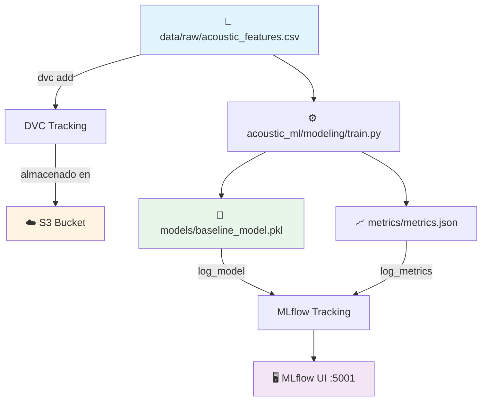

# 🎵 Acoustic ML - Music Emotion Recognition

<div align="center">

**MLOps Team 24 - Proyecto de reconocimiento de emociones musicales**

[](https://www.python.org/downloads/)
[](https://mlflow.org/)
[](https://dvc.org/)
[](https://aws.amazon.com/s3/)

<!-- Badges -->
[](#verificación-rápida-antes-de-trabajar)
[](#reproducibilidad-de-entornos)
[](#buenas-prácticas-con-notebooks)

</div>

---

## 📋 Tabla de Contenidos

- [Sobre el Proyecto](#-sobre-el-proyecto)
- [Información Académica](#-información-académica)
- [Estructura del Proyecto](#-estructura-del-proyecto)
- [Requisitos Previos](#-requisitos-previos)
- [Instalación](#-instalación)
- [Uso](#-uso)
  - [Usando el Makefile](#%EF%B8%8F-usando-el-makefile)
  - [Usando el Módulo acoustic_ml](#-usando-el-módulo-acoustic_ml)
  - [Trabajar con Notebooks](#trabajar-con-notebooks)
  - [Tracking de Experimentos](#tracking-de-experimentos)
  - [Pipeline DVC](#pipeline-dvc)
- [Verificación Rápida antes de Trabajar](#-verificación-rápida-antes-de-trabajar)
- [Reproducibilidad de Entornos](#-reproducibilidad-de-entornos)
- [Buenas Prácticas con Notebooks](#-buenas-prácticas-con-notebooks)
- [Limpieza Local](#-limpieza-local)
- [Arquitectura del Pipeline](#-arquitectura-del-pipeline)
- [Contribución](#-contribución)
- [Equipo](#-equipo)

---

## 🎯 Sobre el Proyecto

Este repositorio contiene la implementación completa de un sistema MLOps para reconocimiento de emociones en música, siguiendo las mejores prácticas de la industria con la estructura **Cookiecutter Data Science**. El proyecto integra:

- 📊 **Versionado de datos** con DVC
- 🔄 **Pipelines reproducibles** automatizados
- 📈 **Tracking de experimentos** con MLflow
- ☁️ **Almacenamiento en la nube** (AWS S3)
- 🤖 **Modelos de Machine Learning** versionados
- 🏗️ **Estructura modular** siguiendo estándares de la industria

---

## 📘 Información Académica

**Instituto Tecnológico y de Estudios Superiores de Monterrey**  
*Maestría en Inteligencia Artificial Aplicada (MNA)*

- **Curso:** Operaciones de Aprendizaje Automático
- **Periodo:** Septiembre – Diciembre 2025
- **Equipo:** N° 24

### 👨‍🏫 Profesores

| Rol | Nombre |
|-----|--------|
| Titular | Dr. Gerardo Rodríguez Hernández |
| Titular | Mtro. Ricardo Valdez Hernández |
| Asistente | Mtra. María Mylen Treviño Elizondo |
| Tutor | José Ángel Martínez Navarro |

---

## 🏗️ Estructura del Proyecto

Organizado siguiendo **Cookiecutter Data Science** para máxima reproducibilidad y claridad:

```
├── LICENSE                 <- Licencia del proyecto
├── Makefile               <- Comandos útiles (make data, make train, etc.)
├── README.md              <- Este archivo
├── pyproject.toml         <- Configuración del proyecto y dependencias
│
├── data
│   ├── external           <- Datos de fuentes externas
│   ├── interim            <- Datos intermedios transformados
│   ├── processed          <- Datasets finales para modelado
│   └── raw                <- Datos originales inmutables (versionados con DVC)
│       ├── acoustic_features.csv
│       └── acoustic_features.csv.dvc
│
├── models                 <- Modelos entrenados y serializados
│   └── baseline_model.pkl
│
├── notebooks              <- Jupyter notebooks para exploración
│   ├── Fase1_equipo24.ipynb
│   └── NoteBook Testing.ipynb
│   
│   Convención de nombres: número-iniciales-descripción
│   Ej: 1.0-hw-exploratory-analysis.ipynb
│
├── reports                <- Análisis generados (HTML, PDF, etc.)
│   └── figures            <- Gráficas y figuras para reportes
│
├── references             <- Diccionarios de datos, manuales, etc.
│
├── requirements.txt       <- Dependencias del proyecto (pip freeze)
├── requirements-optional.txt
│
├── scripts                <- Scripts auxiliares
│   └── train_baseline.py
│
├── acoustic_ml            <- Código fuente del proyecto (módulo Python)
│   ├── __init__.py        <- Hace de acoustic_ml un módulo Python
│   ├── config.py          <- Configuración y variables globales
│   ├── dataset.py         <- Scripts para cargar/generar datos
│   ├── features.py        <- Feature engineering
│   ├── plots.py           <- Visualizaciones
│   └── modeling           
│       ├── __init__.py
│       ├── train.py       <- Entrenamiento de modelos
│       └── predict.py     <- Inferencia con modelos
│
├── metrics                <- Métricas del pipeline DVC
│   └── metrics.json
│
├── mlruns                 <- Experimentos de MLflow
├── mlartifacts            <- Artifacts de MLflow
├── dvcstore               <- Almacenamiento local de DVC
│
├── .dvc                   <- Configuración de DVC
├── dvc.yaml               <- Definición del pipeline DVC
├── dvc.lock               <- Lock file del pipeline
│
├── .git                   <- Control de versiones Git
└── .venv                  <- Entorno virtual de Python
```

---

## 🛠 Requisitos Previos

Antes de comenzar, asegúrate de tener instalado:

- **Python 3.12**
- **Git**
- **Make** (incluido en macOS/Linux; en Windows usar Git Bash)
- **Credenciales de AWS** configuradas

---

## 🚀 Instalación

### 1. Clonar el repositorio

```bash
git clone https://github.com/jrebull/MLOps_Team24.git
cd MLOps_Team24
```

### 2. Configurar entorno virtual

```bash
python -m venv .venv
source .venv/bin/activate  # En Windows: .venv\Scripts\activate
pip install -r requirements.txt
```

### 3. Instalar el módulo acoustic_ml en modo desarrollo

```bash
pip install -e .
```

Esto permite importar el módulo desde cualquier lugar:
```python
from acoustic_ml.dataset import load_raw_data
from acoustic_ml.modeling.train import train_model
```

### 4. Configurar AWS

Crea o edita el archivo `~/.aws/credentials`:

```ini
[default]
aws_access_key_id = TU_ACCESS_KEY_ID
aws_secret_access_key = TU_SECRET_ACCESS_KEY
region = us-east-1
```

### 5. Descargar datos y modelos

```bash
dvc pull
# o usando make:
make pull
```

---

## 💻 Uso

### 🛠️ Usando el Makefile

Este repo incluye un `Makefile` con comandos cortos para las tareas comunes.

#### Comandos disponibles

```bash
# 1) Configurar entorno y dependencias
make setup

# 2) Abrir Jupyter Lab
make jupyter

# 3) Levantar MLflow en http://127.0.0.1:5001
make mlflow

# 4) Reproducir pipeline (solo si hubo cambios)
make reproduce

# 5) Forzar etapa de entrenamiento (nuevo run en MLflow)
make train

# 6) Ver métricas actuales y diferencias
make metrics
make diff

# 7) Sincronizar artefactos con el remoto DVC (S3)
make pull
make push

# 8) Limpiar el entorno local
make clean
make clean-caches

# 9) Exportar dependencias actuales
make freeze

# 10) Verificar sincronización antes de trabajar
make verify-sync
```

### 🐍 Usando el Módulo acoustic_ml

El proyecto está organizado como un módulo Python instalable. Ejemplos de uso:

#### Cargar datos

```python
from acoustic_ml.dataset import load_raw_data, save_processed_data

# Cargar datos crudos
df = load_raw_data("acoustic_features.csv")

# Procesar y guardar
df_processed = process_data(df)
save_processed_data(df_processed, "features_v1.csv")
```

#### Feature Engineering

```python
from acoustic_ml.features import create_features, select_features

# Crear features adicionales
df_with_features = create_features(df)

# Seleccionar features específicas
features = ['tempo', 'energy', 'valence']
df_selected = select_features(df_with_features, features)
```

#### Entrenar modelos

```python
from acoustic_ml.modeling.train import train_model

# Entrenar modelo (registra en MLflow automáticamente)
model = train_model(X_train, y_train)
```

#### Hacer predicciones

```python
from acoustic_ml.modeling.predict import load_model, predict

# Cargar modelo entrenado
model = load_model("baseline_model.pkl")

# Predecir
predictions = predict(model, X_test)
```

#### Crear visualizaciones

```python
from acoustic_ml.plots import plot_feature_importance, save_figure

# Crear gráfica
fig = plot_feature_importance(feature_importance_dict)

# Guardar en reports/figures/
save_figure(fig, "feature_importance.png")
```

### Trabajar con Notebooks

**Jupyter Lab:**
```bash
jupyter-lab
# o usando make:
make jupyter
```

**VSCode:**
```bash
code .
```

**Importar módulo en notebooks:**
```python
# En tus notebooks ahora puedes hacer:
from acoustic_ml.dataset import load_raw_data
from acoustic_ml.config import RAW_DATA_DIR, MODELS_DIR

# Cargar datos
df = load_raw_data()
print(f"Datos cargados desde: {RAW_DATA_DIR}")
```

### Tracking de Experimentos

Inicia el servidor MLflow:

```bash
mlflow ui --port 5001
# o usando make:
make mlflow
```

Accede a la interfaz en: **http://127.0.0.1:5001**

### Pipeline DVC

**Ejecutar el pipeline completo:**
```bash
dvc repro
# o usando make:
make reproduce
```

**Ver métricas actuales:**
```bash
dvc metrics show
# o usando make:
make metrics
```

**Comparar métricas entre commits:**
```bash
dvc metrics diff
# o usando make:
make diff
```

---

## ✅ Verificación Rápida antes de Trabajar

> Usa el `Makefile` para confirmar que tu repo está **limpio**, **sincronizado** y que el notebook principal **no tiene diffs**.

```bash
make verify-sync
# o, si trabajas con otro notebook:
make verify-sync NOTEBOOK=notebooks/tu_notebook.ipynb
```

**Qué valida:**
- ✓ Árbol de trabajo limpio (sin cambios sin commit)
- ✓ HEAD == origin/<rama> (sin ahead/behind)
- ✓ El notebook indicado no tiene diferencias locales

Si algo falla, el comando te dirá exactamente qué corregir (pull/push/diff).

---

## 🔄 Reproducibilidad de Entornos

Exporta dependencias después de instalar paquetes nuevos:

```bash
make freeze
# luego:
git add requirements.txt
git commit -m "chore: update dependencies"
git push
```

Reconstrucción rápida en cualquier máquina:

```bash
python -m venv .venv
source .venv/bin/activate   # Windows: .venv\Scripts\activate
pip install -r requirements.txt
pip install -e .  # Instalar módulo acoustic_ml
```

---

## 📓 Buenas Prácticas con Notebooks

Instala hooks para limpiar outputs y tener diffs legibles:

```bash
make nb-hooks
```

**Beneficios:**
- `nbstripout` limpia salidas/celdas ejecutadas al commitear
- `nbdime` muestra diffs de `.ipynb` de forma amigable

**Convención de nombres para notebooks:**
```
<número>.<versión>-<iniciales>-<descripción-corta>.ipynb

Ejemplos:
- 1.0-jrs-initial-data-exploration.ipynb
- 2.0-hw-feature-engineering.ipynb
- 3.1-sc-model-evaluation.ipynb
```

**Tip:** Antes de commitear, puedes correr `make verify-sync` para asegurarte de que todo está en orden.

---

## 🧹 Limpieza Local

Si necesitas borrar cachés locales (sin afectar Git):

```bash
make clean-caches
```

Esto elimina `__pycache__`, `.ipynb_checkpoints` y archivos temporales solo en tu máquina.

Limpieza completa (incluye artefactos de MLflow/DVC):
```bash
make clean
```

---

## 🏗 Arquitectura del Pipeline



**Flujo de trabajo:**

1. Los datos crudos viven en `data/raw/` y se versionan con DVC
2. Se almacenan en S3 para colaboración
3. El módulo `acoustic_ml` procesa datos y entrena modelos
4. Modelos entrenados se guardan en `models/`
5. Experimentos y artefactos se registran en MLflow
6. Métricas se trackean con DVC en `metrics/metrics.json`
7. Todo es reproducible y trazable

---

## 🤝 Contribución

### Flujo de trabajo

1. **Verificar sincronización:**
   ```bash
   make verify-sync
   ```

2. **Crear una nueva rama:**
   ```bash
   git checkout -b feat/nombre-descriptivo
   ```

3. **Realizar cambios:**
   
   **Si modificas código Python:**
   ```bash
   # Edita archivos en acoustic_ml/
   vim acoustic_ml/features.py
   
   # Los cambios están disponibles inmediatamente (instalación en modo -e)
   ```

   **Si modificas datos:**
   ```bash
   dvc add data/raw/nuevo_dataset.csv
   git add data/raw/nuevo_dataset.csv.dvc .gitignore
   ```

   **Si instalaste paquetes:**
   ```bash
   make freeze
   git add requirements.txt
   ```

4. **Commitear cambios:**
   ```bash
   git add .
   git commit -m "feat: descripción clara del cambio"
   ```

5. **Subir cambios:**
   ```bash
   git push origin feat/nombre-descriptivo
   dvc push  # o: make push
   ```

6. **Crear Pull Request** a la rama `main`

### Buenas prácticas

- ✅ Ejecuta `make verify-sync` antes de comenzar a trabajar
- ✅ Ejecuta `make reproduce` antes de hacer commit
- ✅ Documenta tus experimentos en MLflow
- ✅ Escribe mensajes de commit descriptivos ([Conventional Commits](https://www.conventionalcommits.org/))
- ✅ Mantén el código limpio y con docstrings
- ✅ Usa `make nb-hooks` para configurar hooks de notebooks
- ✅ Escribe código en el módulo `acoustic_ml/`, no en notebooks
- ✅ Los notebooks son para exploración, el código productivo va en el módulo

---

## 👥 Equipo

<table>
  <tr>
    <td align="center">
      <strong>Sandra Luz Cervantes Espinoza</strong><br>
      <sub>A01796937</sub>
    </td>
    <td align="center">
      <strong>Héctor Jesús López Meza</strong><br>
      <sub>A01226881</sub>
    </td>
    <td align="center">
      <strong>Mauricio Torres Baena</strong><br>
      <sub>A01796697</sub>
    </td>
  </tr>
  <tr>
    <td align="center">
      <strong>David Cruz Beltrán</strong><br>
      <sub>A01360416</sub>
    </td>
    <td align="center">
      <strong>Javier Augusto Rebull Saucedo</strong><br>
      <sub>A01795838</sub>
    </td>
    <td></td>
  </tr>
</table>

---

<div align="center">

**⭐ Si este proyecto te resulta útil, considera darle una estrella**

Desarrollado con ❤️ por el Equipo 24 | Estructura basada en [Cookiecutter Data Science](https://drivendata.github.io/cookiecutter-data-science/)

</div>
