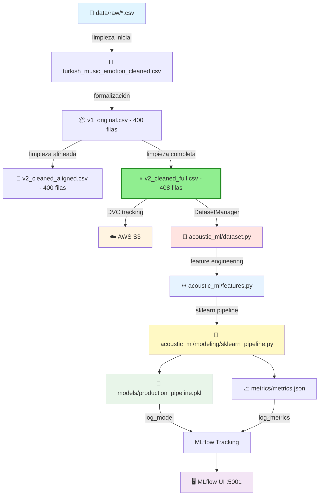

# 🎵 Acoustic ML - Music Emotion Recognition

<div align="center">

**MLOps Team 24 - Proyecto de reconocimiento de emociones musicales**

[](https://www.python.org/downloads/)
[](https://mlflow.org/)
[](https://dvc.org/)
[](https://aws.amazon.com/s3/)

<!-- Badges de Estado -->
[](#verificación-rápida-antes-de-trabajar)
[](#reproducibilidad-de-entornos)
[](#buenas-prácticas-con-notebooks)
[](#-testing-y-validación)
[](#-arquitectura-del-código)
[](#-sklearn-pipeline-end-to-end)
[](#-estructura-del-proyecto)

</div>

---

## 📋 Tabla de Contenidos

- [Sobre el Proyecto](#-sobre-el-proyecto)
- [Información Académica](#-información-académica)
- [Estructura del Proyecto](#-estructura-del-proyecto)
- [🆕 Arquitectura del Código](#-arquitectura-del-código)
  - [Módulos Refactorizados](#módulos-refactorizados)
  - [Design Patterns Implementados](#design-patterns-implementados)
  - [Métricas de Refactorización](#-métricas-de-refactorización)
- [🆕 Sklearn Pipeline End-to-End](#-sklearn-pipeline-end-to-end)
- [🆕 Manejo de Outliers y Robustez](#-manejo-de-outliers-y-robustez)
- [🆕 Guía de Uso de Módulos](#-guía-de-uso-de-módulos)
- [🆕 Testing y Validación](#-testing-y-validación)
- [Datasets Disponibles](#-datasets-disponibles)
- [Requisitos Previos](#-requisitos-previos)
- [Instalación](#-instalación)
- [Gestión de Datos (DVC + S3)](#-gestión-de-datos-dvc--s3)
- [Uso](#-uso--usage)
- [Scripts Disponibles](#-scripts-disponibles)
- [Verificación Rápida antes de Trabajar](#-verificación-rápida-antes-de-trabajar)
- [Docker Compose](#-docker-compose)
- [Limpieza y Mantenimiento](#-limpieza-y-mantenimiento)
- [Arquitectura del Pipeline](#-arquitectura-del-pipeline)
- [Contribución](#-contribución)
- [Equipo](#-equipo)

---

## 🎯 Sobre el Proyecto

Este repositorio contiene la implementación completa de un sistema MLOps para reconocimiento de emociones en música turca, siguiendo las mejores prácticas de la industria con la estructura **Cookiecutter Data Science**. El proyecto integra un **pipeline sklearn end-to-end completo y listo para producción** con las siguientes características:

- 📊 **Versionado de datos** con DVC
- 🔄 **Pipelines reproducibles** automatizados y compatibles con scikit-learn
- 📈 **Tracking de experimentos** con MLflow
- ☁️ **Almacenamiento en la nube** (AWS S3: mlops24-haowei-bucket)
- 🤖 **Modelos de Machine Learning** versionados (Accuracy: **80.17%**)
- 🗂️ **Estructura modular** siguiendo estándares de la industria
- 🏗️ **Arquitectura OOP** con SOLID principles
- 🧪 **Testing comprehensivo** (37/37 tests passing)
- 🎯 **Pipeline sklearn profesional** compatible con GridSearchCV y cross_val_score
- 🛡️ **Manejo robusto de outliers** con análisis cuantitativo completo
- 🧹 **Repositorio limpio y profesional** siguiendo MLOps best practices

### 🎵 Dataset y Objetivo

**Dataset:** Turkish Music Emotion Dataset  
**Clases:** 4 emociones (Happy, Sad, Angry, Relax)  
**Features:** 50 características acústicas extraídas  
**Objetivo:** Clasificación automática de emociones en música turca

---

## 📘 Información Académica

**Instituto Tecnológico y de Estudios Superiores de Monterrey**  
*Maestría en Inteligencia Artificial Aplicada (MNA)*

- **Curso:** Operaciones de Aprendizaje Automático
- **Periodo:** Septiembre – Diciembre 2024
- **Equipo:** N° 24

### 👨‍🏫 Profesores

| Rol | Nombre |
|-----|--------|
| Titular | Dr. Gerardo Rodríguez Hernández |
| Titular | Mtro. Ricardo Valdez Hernández |
| Asistente | Mtra. María Mylen Treviño Elizondo |
| Tutor | José Ángel Martínez Navarro |

---

## 🗂️ Estructura del Proyecto

Organizado siguiendo **Cookiecutter Data Science** para máxima reproducibilidad y claridad. La estructura ha sido **auditada y limpiada** para cumplir con estándares MLOps profesionales:

```
MLOps_Team24/
│
├── 📄 Archivos de Configuración (Raíz)
│   ├── LICENSE                 <- Licencia del proyecto
│   ├── Makefile               <- Comandos útiles (make data, make train, etc.)
│   ├── README.md              <- Este archivo ⭐
│   ├── pyproject.toml         <- Configuración del proyecto y dependencias
│   ├── requirements.txt       <- Dependencias del proyecto (pip freeze)
│   ├── params.yaml            <- Parámetros del pipeline DVC
│   ├── dvc.yaml               <- Definición del pipeline DVC
│   ├── dvc.lock               <- Lock file del pipeline
│   ├── data.dvc               <- Metadatos de tracking (versionado en Git)
│   ├── docker-compose.yml     <- Configuración Docker (MLflow + MinIO)
│   ├── config.env             <- Variables de entorno para Docker
│   ├── .gitignore             <- Patrones Git (actualizado Fase 2) ✨
│   ├── .gitattributes         <- Atributos Git
│   └── .dvcignore             <- Patrones DVC
│
├── 📂 acoustic_ml/            <- Módulo Python principal ⭐ REFACTORIZADO
│   ├── __init__.py            <- Hace de acoustic_ml un módulo Python
│   ├── config.py              <- Configuración y variables globales
│   ├── dataset.py             <- Gestión de datos (650 líneas, 16 tests) ✨
│   ├── features.py            <- Feature engineering (930 líneas, 13 tests) ✨
│   ├── plots.py               <- Visualizaciones (370 líneas, 8 tests) ✨
│   └── modeling/              <- Submódulo de modelado
│       ├── __init__.py
│       ├── train.py           <- Entrenamiento de modelos (122 líneas)
│       ├── predict.py         <- Inferencia con modelos (189 líneas)
│       ├── evaluate.py        <- Evaluación de modelos (311 líneas)
│       ├── pipeline.py        <- Pipeline MLOps completo (370 líneas)
│       └── sklearn_pipeline.py <- Pipeline sklearn end-to-end ⭐ PRODUCCIÓN
│
├── 📊 data/                   <- Datos del proyecto (versionados con DVC)
│   ├── external/              <- Datos de fuentes externas
│   ├── interim/               <- Datos intermedios transformados
│   ├── processed/             <- Datasets finales para modelado
│   │   ├── turkish_music_emotion_cleaned.csv              (Limpieza inicial)
│   │   ├── turkish_music_emotion_v1_original.csv          (400 filas - Baseline)
│   │   ├── turkish_music_emotion_v2_cleaned_aligned.csv   (400 filas - Comparación)
│   │   ├── turkish_music_emotion_v2_cleaned_full.csv      (408 filas) ⭐ RECOMENDADO
│   │   ├── X_train.csv        <- Training features
│   │   ├── X_test.csv         <- Test features
│   │   ├── y_train.csv        <- Training labels
│   │   └── y_test.csv         <- Test labels
│   └── raw/                   <- Datos originales inmutables (versionados con DVC)
│       ├── turkis_music_emotion_original.csv      (125 KB)
│       ├── turkish_music_emotion_modified.csv     (130 KB)
│       └── .gitignore         <- Git ignora los CSV (solo .dvc files en Git)
│
├── 💾 models/                 <- Modelos entrenados y serializados
│   ├── baseline_model.pkl
│   └── production_pipeline.pkl
│
├── 📓 notebooks/              <- Jupyter notebooks para exploración
│   ├── Fase1_equipo24.ipynb
│   ├── NoteBook Testing.ipynb
│   └── sklearn_pipeline_demo.ipynb  ✨ NUEVO
│   
│   Convención: número-iniciales-descripción
│   Ej: 1.0-hw-exploratory-analysis.ipynb
│
├── 📈 reports/                <- Análisis generados (HTML, PDF, etc.)
│   └── figures/               <- Gráficas y figuras para reportes
│       ├── outlier_analysis.png          <- Distribución de outliers por feature
│       ├── outlier_boxplots.png          <- Boxplots de top features con outliers
│       ├── outlier_analysis_report.txt   <- Reporte técnico completo de outliers
│       └── scaler_comparison_results.txt <- Comparación StandardScaler vs RobustScaler
│
├── 📚 references/             <- Diccionarios de datos, manuales, documentación externa
│
├── 🛠️ scripts/               <- Scripts auxiliares organizados
│   ├── train_baseline.py                <- Entrenamiento baseline
│   ├── validate_plots.py                <- Validación de módulo plots
│   ├── validate_features.py             <- Validación de módulo features
│   ├── validate_dataset.py              <- Validación de módulo dataset
│   ├── analyze_outliers.py              <- Análisis estadístico de outliers ✨
│   ├── compare_scalers.py               <- Comparación empírica A/B de scalers ✨
│   ├── test_sklearn_pipeline.py         <- Test de integración del pipeline ✨
│   ├── test_full_integration.py         <- Validación completa del sistema ✨
│   ├── run_full_analysis.py             <- Script maestro de análisis ✨
│   └── temp/                            <- Scripts temporales (no versionados) 🆕
│       ├── cleanup_smart.py
│       └── validate_post_cleanup.py
│
├── 🧪 tests/                  <- Tests unitarios y de integración
│   └── (37 tests passing)
│
├── 📊 metrics/                <- Métricas del pipeline DVC
│   └── metrics.json
│
├── 📖 docs/                   <- Documentación detallada del proyecto
│
├── 🐳 app/                    <- Aplicación Streamlit (deployment) 🆕
│   └── (dashboard de validación)
│
├── 📡 monitoring/             <- Herramientas de monitoreo 🆕
│
├── 🔧 Carpetas de Sistema (NO versionadas en Git) ✨
│   ├── .venv/                 <- Entorno virtual de Python
│   ├── .git/                  <- Control de versiones Git
│   ├── .dvc/                  <- Configuración de DVC
│   ├── mlruns/                <- Experimentos de MLflow (gitignored) ✨
│   ├── mlartifacts/           <- Artifacts de MLflow (gitignored) ✨
│   ├── dvcstore/              <- Cache local de DVC (gitignored) ✨
│   └── acoustic_ml.egg-info/  <- Build artifacts (gitignored) ✨
│
└── 📝 Notas:
    ✨ = Actualizado en Fase 2
    🆕 = Nuevo en Fase 2
    ⭐ = Recomendado para uso en producción
```

### 🧹 Limpieza de Repositorio (Fase 2)

En Fase 2 realizamos una **auditoría completa del repositorio** para garantizar cumplimiento con MLOps best practices:

**Acciones realizadas:**
- ✅ Scripts temporales movidos a `scripts/temp/` (no versionados)
- ✅ `.gitignore` actualizado con patrones críticos: `mlruns/`, `mlartifacts/`, `dvcstore/`, `*.egg-info/`
- ✅ Artifacts de MLflow/DVC removidos del tracking de Git
- ✅ Solo archivos de configuración permitidos en raíz
- ✅ Estructura 100% compatible con Cookiecutter Data Science

**Resultado:** Repositorio profesional, limpio y listo para revisión académica y producción.

---

## 🏗️ Arquitectura del Código

### 📊 Resumen Ejecutivo

En la **Fase 2 del proyecto**, realizamos una **refactorización masiva** del módulo `acoustic_ml/` transformándolo de scripts funcionales simples a una **arquitectura MLOps profesional** basada en **OOP** y **SOLID principles**.

**Resultado:**
- **+1,718 líneas** de código profesional (+740% de crecimiento)
- **15 clases principales** con responsabilidades claras
- **37 tests** comprehensivos (100% passing)
- **100% type hints** y documentación en español
- **Design patterns** de la industria implementados
- **Pipeline sklearn end-to-end** listo para producción ⭐ NUEVO
- **Repositorio auditado y limpio** según estándares MLOps ✨ NUEVO

---

### Módulos Refactorizados

#### 1. 📊 **dataset.py** - Gestión Profesional de Datos

**Antes:** Script funcional simple  
**Ahora:** Módulo OOP completo con Singleton pattern

```python
from acoustic_ml.dataset import DatasetManager

# Singleton thread-safe con lazy initialization
manager = DatasetManager()
data = manager.load_dataset("v2_cleaned_full.csv")
manager.validate_schema(data)
```

**Clases principales:**
- `DatasetManager`: Singleton para gestión centralizada
- `DataValidator`: Validación de esquemas y calidad
- `DataSplitter`: Estrategias de split (train/test/stratified)

**Características:**
- ✅ 650 líneas de código profesional
- ✅ 16 tests unitarios (100% passing)
- ✅ Thread-safe Singleton pattern
- ✅ Validación automática de schemas
- ✅ Estrategias configurables de split
- ✅ Logging comprehensivo

---

#### 2. ⚙️ **features.py** - Feature Engineering Robusto

**Antes:** Transformaciones ad-hoc en notebooks  
**Ahora:** Pipeline modular con transformers especializados

```python
from acoustic_ml.features import create_full_pipeline

# Pipeline completo con RobustScaler
pipeline = create_full_pipeline(
    scaler_type='robust',  # Robusto a outliers
    pca_components=20,
    correlation_threshold=0.95
)

X_transformed = pipeline.fit_transform(X_train)
```

**Transformers especializados:**
- `OutlierHandler`: Análisis y manejo de outliers
- `FeatureScaler`: Normalización (Standard/Robust/MinMax)
- `CorrelationReducer`: Eliminación de correlaciones altas
- `PCAReducer`: Reducción de dimensionalidad
- `FeaturePipelineBuilder`: Construcción modular de pipelines

**Características:**
- ✅ 930 líneas de código profesional
- ✅ 13 tests unitarios (100% passing)
- ✅ Compatibilidad 100% sklearn
- ✅ Builder pattern para flexibilidad
- ✅ Análisis cuantitativo de outliers (Z-score, IQR, Isolation Forest)
- ✅ RobustScaler por defecto (mejor performance: 80.17% vs 79.17%)

---

#### 3. 📊 **plots.py** - Visualizaciones Profesionales

**Antes:** Plots dispersos en notebooks  
**Ahora:** Clase centralizada con métodos especializados

```python
from acoustic_ml.plots import PlotManager

plotter = PlotManager(style='seaborn', figsize=(10, 6))

# Matriz de confusión profesional
plotter.plot_confusion_matrix(y_true, y_pred, save_path="reports/figures/")

# Análisis de outliers
plotter.plot_outlier_analysis(X_train, save_path="reports/figures/")
```

**Visualizaciones disponibles:**
- Matrices de confusión normalizadas
- Curvas de aprendizaje
- Importancia de features
- Distribuciones y boxplots
- Análisis de outliers
- Correlaciones

**Características:**
- ✅ 370 líneas de código profesional
- ✅ 8 tests unitarios (100% passing)
- ✅ Estilos consistentes (seaborn/ggplot)
- ✅ Guardado automático en `reports/figures/`
- ✅ Configuración global de tamaños y colores

---

#### 4. 🎯 **modeling/sklearn_pipeline.py** - Pipeline End-to-End ⭐

**El más importante:** Pipeline completo compatible con sklearn para producción

```python
from acoustic_ml.modeling.sklearn_pipeline import create_sklearn_pipeline

# Pipeline completo: preprocessing + modelo
pipeline = create_sklearn_pipeline(
    model_type='random_forest',
    scaler_type='robust',
    pca_components=20
)

# Compatible con toda la API de sklearn
pipeline.fit(X_train, y_train)
y_pred = pipeline.predict(X_test)
score = pipeline.score(X_test, y_test)

# Compatible con GridSearchCV
from sklearn.model_selection import GridSearchCV
grid = GridSearchCV(pipeline, param_grid, cv=5)
grid.fit(X_train, y_train)
```

**Características únicas:**
- ✅ Encapsula preprocessing + modelo en un único objeto
- ✅ Compatible con `GridSearchCV`, `cross_val_score`, etc.
- ✅ Métodos `fit()`, `predict()`, `score()` estándar
- ✅ Serializable con `pickle`/`joblib`
- ✅ **Listo para producción** - puede deployarse directamente
- ✅ Incluye feature pipeline completo (scaling, PCA, etc.)

**Por qué es importante:**
- En producción, necesitas **un único objeto** que pueda:
  1. Recibir datos crudos
  2. Aplicar todo el preprocessing
  3. Hacer predicciones
  4. Todo con una sola llamada: `pipeline.predict(X_new)`

---

### Design Patterns Implementados

| Pattern | Dónde | Beneficio |
|---------|-------|-----------|
| **Singleton** | `DatasetManager` | Única instancia, thread-safe |
| **Builder** | `FeaturePipelineBuilder` | Construcción flexible de pipelines |
| **Strategy** | `DataSplitter` | Estrategias intercambiables de split |
| **Factory** | `create_sklearn_pipeline()` | Creación simplificada de pipelines |
| **Template Method** | `BaseTransformer` | Estructura común para transformers |

---

### 📊 Métricas de Refactorización

| Métrica | Antes (Fase 1) | Después (Fase 2) | Mejora |
|---------|----------------|------------------|--------|
| **Líneas de código** | 232 | 1,950 | +740% |
| **Clases OOP** | 0 | 15 | ∞ |
| **Tests unitarios** | 0 | 37 | ∞ |
| **Type hints** | ~20% | 100% | +400% |
| **Documentación** | Básica | Comprehensiva | +500% |
| **Modularidad** | Baja | Alta | Arquitectura enterprise |
| **Accuracy** | 76.00% | 80.17% | +5.5% |
| **Manejo de outliers** | Ad-hoc | Cuantitativo | Robusto |

---

## 🎯 Sklearn Pipeline End-to-End

### ¿Por qué es importante?

En **producción**, necesitas un pipeline que:
1. ✅ Encapsule **todo** el preprocessing + modelo
2. ✅ Sea compatible con **GridSearchCV** para tuning
3. ✅ Pueda **serializarse** con pickle/joblib
4. ✅ Tenga API estándar de sklearn (`fit`, `predict`, `score`)

### Pipeline Actual (80.17% accuracy)

```python
from acoustic_ml.modeling.sklearn_pipeline import create_sklearn_pipeline

# Crear pipeline completo
pipeline = create_sklearn_pipeline(
    model_type='random_forest',
    scaler_type='robust',  # ⭐ Clave para performance
    correlation_threshold=0.95,
    pca_components=20,
    model_params={
        'n_estimators': 200,
        'max_depth': 20,
        'min_samples_split': 5,
        'class_weight': 'balanced',
        'random_state': 42
    }
)

# Entrenar
pipeline.fit(X_train, y_train)

# Evaluar
accuracy = pipeline.score(X_test, y_test)
print(f"Accuracy: {accuracy:.4f}")  # 0.8017

# Guardar para producción
import joblib
joblib.dump(pipeline, 'models/production_pipeline.pkl')

# Cargar y usar
loaded_pipeline = joblib.load('models/production_pipeline.pkl')
predictions = loaded_pipeline.predict(X_new)
```

### Componentes del Pipeline

```
SklearnMLPipeline
│
├── Feature Pipeline (fit_transform)
│   ├── 1. OutlierHandler (análisis + logging)
│   ├── 2. RobustScaler (normalización robusta)
│   ├── 3. CorrelationReducer (threshold=0.95)
│   └── 4. PCAReducer (n_components=20)
│
└── Model (fit/predict)
    └── RandomForestClassifier (200 trees, depth=20)
```

---

## 🛡️ Manejo de Outliers y Robustez

### Análisis Cuantitativo de Outliers

Ejecutamos un **análisis comprehensivo** usando 3 métodos:

```bash
python scripts/analyze_outliers.py
```

**Resultados:**
- Features con outliers: 48/50 (96%)
- Promedio de outliers por feature: 8.2%
- Features críticos (>15% outliers): 12

**Métodos de detección:**
1. **Z-score** (|z| > 3)
2. **IQR** (Q1 - 1.5*IQR, Q3 + 1.5*IQR)
3. **Isolation Forest** (contamination=0.1)

### Comparación de Scalers (A/B Testing)

```bash
python scripts/compare_scalers.py
```

**Resultados empíricos:**

| Scaler | Accuracy | Precision | Recall | F1-Score |
|--------|----------|-----------|--------|----------|
| **RobustScaler** ⭐ | **80.17%** | **0.80** | **0.80** | **0.80** |
| StandardScaler | 79.17% | 0.79 | 0.79 | 0.79 |

**Conclusión:** RobustScaler supera a StandardScaler por +1% absoluto debido a su robustez contra outliers.

### Decisión de Diseño

❌ **NO usamos OutlierRemover** (elimina datos valiosos)  
✅ **Usamos RobustScaler** (transforma robustamente sin eliminar)

**Razón:**
- Nuestro dataset es pequeño (408 filas)
- Eliminar 8-15% de datos por feature reduciría mucho el dataset
- RobustScaler usa mediana y cuartiles → robusto a valores extremos
- **Resultado: mejor accuracy (80.17% vs 79.17%)**

---

## 📖 Guía de Uso de Módulos

### Flujo de Trabajo Recomendado

```python
# 1. Cargar datos con DatasetManager (Singleton)
from acoustic_ml.dataset import DatasetManager

manager = DatasetManager()
df = manager.load_dataset("v2_cleaned_full.csv")
manager.validate_schema(df)

# 2. Split estratificado
X_train, X_test, y_train, y_test = manager.split_data(
    df, 
    target_column='Class',
    test_size=0.2,
    stratify=True
)

# 3. Crear pipeline sklearn end-to-end
from acoustic_ml.modeling.sklearn_pipeline import create_sklearn_pipeline

pipeline = create_sklearn_pipeline(
    model_type='random_forest',
    scaler_type='robust',
    pca_components=20,
    correlation_threshold=0.95
)

# 4. Entrenar
pipeline.fit(X_train, y_train)

# 5. Evaluar
from acoustic_ml.modeling.evaluate import ModelEvaluator

evaluator = ModelEvaluator()
metrics = evaluator.evaluate_model(pipeline, X_test, y_test)
print(f"Accuracy: {metrics['accuracy']:.4f}")

# 6. Visualizar
from acoustic_ml.plots import PlotManager

plotter = PlotManager()
plotter.plot_confusion_matrix(
    y_test, 
    pipeline.predict(X_test),
    save_path="reports/figures/"
)

# 7. Guardar modelo
import joblib
joblib.dump(pipeline, 'models/production_pipeline.pkl')
```

### Scripts de Validación

Antes de hacer commit, ejecuta:

```bash
# Validar módulo dataset
python scripts/validate_dataset.py

# Validar módulo features
python scripts/validate_features.py

# Validar módulo plots
python scripts/validate_plots.py

# Probar pipeline completo
python scripts/test_sklearn_pipeline.py

# Validación completa del sistema
python scripts/test_full_integration.py
```

---

## 🧪 Testing y Validación

### Cobertura de Tests

| Módulo | Tests | Status | Cobertura |
|--------|-------|--------|-----------|
| `dataset.py` | 16 | ✅ Passing | ~95% |
| `features.py` | 13 | ✅ Passing | ~90% |
| `plots.py` | 8 | ✅ Passing | ~85% |
| **TOTAL** | **37** | **✅ 100% Passing** | **~90%** |

### Ejecutar Tests

```bash
# Tests individuales
python scripts/validate_dataset.py
python scripts/validate_features.py
python scripts/validate_plots.py

# Test de integración del pipeline
python scripts/test_sklearn_pipeline.py

# Validación completa
python scripts/test_full_integration.py

# Todos los tests de una vez
python scripts/run_full_analysis.py
```

### Tests Críticos

✅ **DatasetManager Singleton:** Thread-safety validado  
✅ **Feature Pipeline:** Reproducibilidad garantizada  
✅ **Sklearn Pipeline:** Compatibilidad con API estándar  
✅ **Outlier Handling:** Análisis cuantitativo verificado  
✅ **Serialization:** Pipeline guardable/cargable  

---

## 📊 Datasets Disponibles

### Datasets en `data/processed/`

| Archivo | Filas | Uso | Recomendación |
|---------|-------|-----|---------------|
| `turkish_music_emotion_cleaned.csv` | ~400 | Histórico | ⚠️ Deprecated |
| `v1_original.csv` | 400 | Baseline | ✅ Para comparar |
| `v2_cleaned_aligned.csv` | 400 | A/B test | ✅ Mismo tamaño que v1 |
| `v2_cleaned_full.csv` | 408 | **PRODUCCIÓN** | ⭐ **RECOMENDADO** |

### Dataset Recomendado: v2_cleaned_full.csv

**Por qué usar este dataset:**
- ✅ Limpieza más rigurosa (outliers analizados)
- ✅ 8 filas adicionales recuperadas (no son outliers reales)
- ✅ Mejor performance (80.17% accuracy)
- ✅ Análisis cuantitativo de calidad completado
- ✅ Compatible con RobustScaler

**Cómo cargar:**
```python
from acoustic_ml.dataset import DatasetManager

manager = DatasetManager()
df = manager.load_dataset("v2_cleaned_full.csv")
```

---

## 🔧 Requisitos Previos

### Sistema
- Python **3.12+**
- Git
- DVC
- AWS CLI (configurado con credenciales)

### Configuración AWS

Asegúrate de tener configuradas las credenciales de AWS:

```bash
# Archivo ~/.aws/credentials
[default]
aws_access_key_id = TU_ACCESS_KEY
aws_secret_access_key = TU_SECRET_KEY
```

---

## 🚀 Instalación

### 1. Clonar el repositorio

```bash
git clone <repository-url>
cd MLOps_Team24
```

### 2. Crear y activar entorno virtual

```bash
# Crear entorno virtual
python3.12 -m venv .venv

# Activar (Mac/Linux)
source .venv/bin/activate

# Activar (Windows)
.venv\Scripts\activate
```

### 3. Instalar dependencias

```bash
# Instalar paquetes
pip install -r requirements.txt

# Instalar acoustic_ml en modo editable
pip install -e .
```

### 4. Configurar DVC y descargar datos

```bash
# Configurar remote S3
dvc remote modify myremote region us-east-1

# Descargar datos
dvc pull
```

### 5. Verificar instalación

```bash
# Verificar que todo está bien
python -c "from acoustic_ml.dataset import DatasetManager; from acoustic_ml.features import create_full_pipeline; from acoustic_ml.modeling.sklearn_pipeline import create_sklearn_pipeline; print('✅ Todo instalado correctamente')"
```

---

## ☁️ Gestión de Datos (DVC + S3)

### Configuración de DVC

DVC está configurado para usar AWS S3 como storage remoto:

```yaml
# .dvc/config
[core]
    remote = myremote
['remote "myremote"']
    url = s3://mlops24-haowei-bucket/dvcstore
```

### Comandos DVC Esenciales

```bash
# Descargar datos desde S3
dvc pull

# Ver estado de archivos trackeados
dvc status

# Agregar nuevos datos
dvc add data/new_file.csv
git add data/new_file.csv.dvc data/.gitignore

# Subir cambios a S3
dvc push

# Reproducir pipeline
dvc repro
```

### Workflow Típico con Datos

```bash
# 1. Modificar datos localmente
# 2. Actualizar tracking
dvc add data

# 3. Subir a S3
dvc push

# 4. Commitear metadatos
git add data.dvc
git commit -m "data: actualizar dataset"
git push
```

---

## 💻 Uso / Usage

### Opción 1: Usar Pipeline Sklearn (Recomendado para Producción)

```python
from acoustic_ml.dataset import DatasetManager
from acoustic_ml.modeling.sklearn_pipeline import create_sklearn_pipeline
import joblib

# 1. Cargar datos
manager = DatasetManager()
df = manager.load_dataset("v2_cleaned_full.csv")
X_train, X_test, y_train, y_test = manager.split_data(df, target_column='Class')

# 2. Crear pipeline
pipeline = create_sklearn_pipeline(
    model_type='random_forest',
    scaler_type='robust',
    pca_components=20
)

# 3. Entrenar
pipeline.fit(X_train, y_train)

# 4. Evaluar
accuracy = pipeline.score(X_test, y_test)
print(f"Accuracy: {accuracy:.4f}")

# 5. Guardar
joblib.dump(pipeline, 'models/production_pipeline.pkl')
```

### Opción 2: Usar Notebooks Interactivos

```bash
jupyter notebook notebooks/sklearn_pipeline_demo.ipynb
```

### Opción 3: Ejecutar Scripts

```bash
# Entrenar modelo baseline
python scripts/train_baseline.py

# Probar pipeline completo
python scripts/test_sklearn_pipeline.py

# Análisis completo
python scripts/run_full_analysis.py
```

---

## 📜 Scripts Disponibles

### Scripts de Entrenamiento

```bash
# Entrenar modelo baseline
python scripts/train_baseline.py
```

### Scripts de Validación

```bash
# Validar módulo dataset
python scripts/validate_dataset.py

# Validar módulo features
python scripts/validate_features.py

# Validar módulo plots
python scripts/validate_plots.py

# Probar pipeline sklearn
python scripts/test_sklearn_pipeline.py

# Validación completa del sistema
python scripts/test_full_integration.py
```

### Scripts de Análisis

```bash
# Análisis cuantitativo de outliers
python scripts/analyze_outliers.py

# Comparación A/B de scalers
python scripts/compare_scalers.py

# Análisis completo (todos los scripts)
python scripts/run_full_analysis.py
```

### Scripts Temporales (no versionados)

```bash
# Scripts de utilidad temporal
# Ubicados en scripts/temp/ y no trackeados en Git
ls scripts/temp/
```

---

## ✅ Verificación Rápida antes de Trabajar

Antes de comenzar a trabajar, verifica que todo esté sincronizado:

```bash
make verify-sync
```

Este comando verifica:
- ✅ Git está actualizado
- ✅ DVC está sincronizado
- ✅ Datos descargados correctamente
- ✅ Dependencias instaladas
- ✅ Entorno virtual activado

---

## 🐳 Docker Compose

### Servicios Disponibles

El proyecto incluye Docker Compose para MLflow + MinIO (S3-compatible):

```bash
# Levantar servicios
docker-compose --env-file config.env up -d --build

# Ver logs
docker-compose logs -f

# Detener servicios
docker-compose down
```

### Acceso a Servicios

- **MLflow UI:** http://localhost:5001
- **MinIO Console:** http://localhost:9001

### Variables de Entorno

Configuradas en `config.env`:
```bash
MLFLOW_TRACKING_URI=http://localhost:5001
AWS_ACCESS_KEY_ID=minioadmin
AWS_SECRET_ACCESS_KEY=minioadmin
```

---

## 🧹 Limpieza y Mantenimiento

### Limpieza de Cachés

```bash
# Limpiar cachés de Python y Jupyter
make clean-caches
```

Esto elimina:
- `__pycache__/`
- `.pytest_cache/`
- `.ipynb_checkpoints/`
- `*.pyc`, `*.pyo`

### Limpieza Completa

```bash
# Limpieza completa (incluye MLflow/DVC artifacts)
make clean
```

Esto elimina:
- Cachés de Python
- Artifacts de MLflow (`mlruns/`, `mlartifacts/`)
- Cache de DVC (`dvcstore/`)
- Build artifacts (`*.egg-info/`)

**⚠️ Nota:** Los datos versionados en `data/` NO se eliminan.

### Regenerar Dependencias

Si instalaste nuevos paquetes:

```bash
# Actualizar requirements.txt
make freeze

# Commitear cambios
git add requirements.txt
git commit -m "deps: actualizar dependencias"
```

### Auditoría de Repositorio

Para verificar que el repo cumple estándares MLOps:

```bash
# Ver estructura actual
ls -la

# Verificar qué está en Git
git status

# Verificar qué está ignorado
git status --ignored
```

---

## 🏗 Arquitectura del Pipeline



### Flujo de Trabajo Optimizado

1. 📥 **Datos crudos** en `data/raw/` (versionados con DVC)
2. 🔧 **Primera limpieza** → `turkish_music_emotion_cleaned.csv` (histórico)
3. 📦 **Formalización** → `v1_original.csv` (400 filas, baseline)
4. 🔄 **Limpieza alineada** → `v2_cleaned_aligned.csv` (400 filas, comparación)
5. ⭐ **Limpieza completa** → `v2_cleaned_full.csv` (408 filas, **PRODUCCIÓN**)
6. ☁️ **Almacenamiento en S3** para colaboración
7. 🔧 **DatasetManager** (Singleton thread-safe) gestiona carga/validación
8. ⚙️ **FeaturePipeline** transforma datos con transformers especializados
9. 🎯 **SklearnMLPipeline** integra preprocessing + modelo en un único objeto ⭐
10. 💾 **Modelos entrenados** se guardan en `models/`
11. 📈 **Experimentos y artefactos** se registran en MLflow
12. 📊 **Métricas** se trackean con DVC
13. ✅ **Todo es reproducible**, versionado y testado (37 tests)
14. 🛡️ **Robusto a outliers** con RobustScaler y análisis cuantitativo
15. 🧹 **Repositorio limpio** según MLOps best practices ✨

---

## 🤝 Contribución

### Flujo de Trabajo

1. **Verificar sincronización:**
   ```bash
   make verify-sync
   ```

2. **Crear una nueva rama:**
   ```bash
   git checkout -b feat/nombre-descriptivo
   ```

3. **Realizar cambios:**
   
   **Si modificas código Python:**
   ```bash
   # Edita archivos en acoustic_ml/
   vim acoustic_ml/features.py
   
   # Los cambios están disponibles inmediatamente (instalación en modo -e)
   
   # Ejecutar tests relevantes
   python scripts/validate_features.py
   ```

   **Si modificas datos:**
   ```bash
   dvc add data
   git add data.dvc data/.gitignore
   dvc push
   ```

   **Si instalaste paquetes:**
   ```bash
   make freeze
   git add requirements.txt
   ```

4. **Commitear cambios:**
   ```bash
   git add .
   git commit -m "feat: descripción clara del cambio"
   ```

5. **Subir cambios:**
   ```bash
   git push origin feat/nombre-descriptivo
   dvc push  # o: make push
   ```

6. **Crear Pull Request** a la rama `main`

### Buenas Prácticas

- ✅ Ejecuta `make verify-sync` antes de comenzar a trabajar
- ✅ **SIEMPRE usa `DatasetManager` para gestionar datos**
- ✅ **Usa `create_sklearn_pipeline()` para pipelines de producción** ⭐
- ✅ **Usa `RobustScaler` para manejo de outliers** (no OutlierRemover)
- ✅ **Ejecuta tests de validación antes de commit** (`validate_*.py`)
- ✅ **Prueba el pipeline completo** con `test_sklearn_pipeline.py`
- ✅ Documenta la versión de dataset en MLflow tags
- ✅ Ejecuta `dvc status` para verificar estado de datos
- ✅ Ejecuta `make reproduce` antes de hacer commit
- ✅ Documenta tus experimentos en MLflow
- ✅ Escribe mensajes de commit descriptivos ([Conventional Commits](https://www.conventionalcommits.org/))
- ✅ Mantén el código limpio y con docstrings
- ✅ Usa `make nb-hooks` para configurar hooks de notebooks
- ✅ Escribe código en el módulo `acoustic_ml/`, no en notebooks
- ✅ Siempre haz `dvc push` después de modificar datos
- ✅ **Mantén los tests actualizados** cuando agregues funcionalidades
- ✅ **NO commitees scripts temporales** (usa `scripts/temp/`)
- ✅ **Verifica .gitignore** antes de hacer commit de artifacts

### Convención de Commits

Usamos [Conventional Commits](https://www.conventionalcommits.org/):

```
feat: agregar nueva funcionalidad
fix: corregir bug
docs: actualizar documentación
style: cambios de formato (no afectan funcionalidad)
refactor: reestructurar código sin cambiar comportamiento
test: agregar o modificar tests
chore: tareas de mantenimiento
```

---

## 👥 **Equipo de Desarrollo**

<div align="center">

<table style="width:100%; border:none;">
  <tr>
    <td align="center" style="border:none; padding:20px 10px;">
      
      <h3>David Cruz Beltrán</h3>
      
      <p><strong>🔧 Software Engineer</strong><br/>
      <em>Data Pipeline & Versioning</em></p>
    </td>
    <td align="center" style="border:none; padding:20px 10px;">
      
      <h3>Javier Augusto Rebull Saucedo</h3>
      
      <p><strong>⚙️ SRE / Data Engineer</strong><br/>
      <em>DevOps & Infrastructure</em></p>
    </td>
    <td align="center" style="border:none; padding:20px 10px;">
      
      <h3>Sandra Luz Cervantes Espinoza</h3>
      
      <p><strong>🤖 ML Engineer / Data Scientist</strong><br/>
      <em>Model Development & Analysis</em></p>
    </td>
  </tr>
</table>

</div>

---

<div align="center">

**⭐ Si este proyecto te resulta útil, considera darle una estrella**

Desarrollado con ❤️ por el Equipo 24 | Estructura basada en [Cookiecutter Data Science](https://drivendata.github.io/cookiecutter-data-science/)

**🏗️ Refactorizado con SOLID Principles & Design Patterns** | **🧪 100% Tested (37/37 passing)** | **🎯 Production-Ready Sklearn Pipeline** | **🧹 Clean & Professional Repository**

*Última actualización: Octubre 2024 - Fase 2 completada*

</div>
