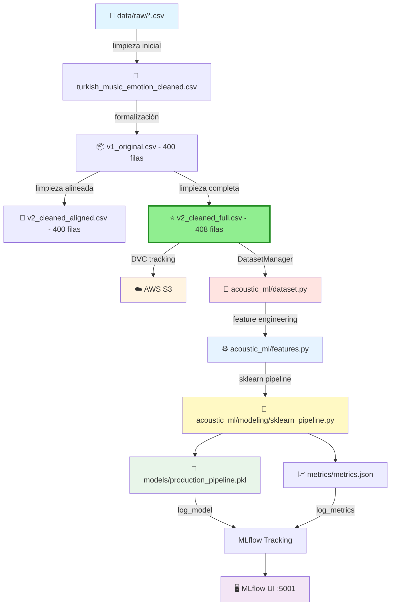

# 🎵 Acoustic ML - Music Emotion Recognition

<div align="center">

**MLOps Team 24 - Proyecto de reconocimiento de emociones musicales**

[](https://www.python.org/downloads/)
[](https://mlflow.org/)
[](https://dvc.org/)
[](https://aws.amazon.com/s3/)

<!-- Badges -->
[](#verificación-rápida-antes-de-trabajar)
[](#reproducibilidad-de-entornos)
[](#buenas-prácticas-con-notebooks)
[](#-testing-y-validación)
[](#-arquitectura-del-código)
[](#-sklearn-pipeline-end-to-end)

</div>

---

## 📋 Tabla de Contenidos

- [Sobre el Proyecto](#-sobre-el-proyecto)
- [Información Académica](#-información-académica)
- [Estructura del Proyecto](#-estructura-del-proyecto)
- [🆕 Arquitectura del Código](#-arquitectura-del-código)
  - [Módulos Refactorizados](#módulos-refactorizados)
  - [Design Patterns Implementados](#design-patterns-implementados)
  - [Métricas de Refactorización](#-métricas-de-refactorización)
- [🆕 Sklearn Pipeline End-to-End](#-sklearn-pipeline-end-to-end)
- [🆕 Manejo de Outliers y Robustez](#-manejo-de-outliers-y-robustez)
- [🆕 Guía de Uso de Módulos](#-guía-de-uso-de-módulos)
- [🆕 Testing y Validación](#-testing-y-validación)
- [Datasets Disponibles](#-datasets-disponibles)
- [Requisitos Previos](#-requisitos-previos)
- [Instalación](#-instalación)
- [Gestión de Datos (DVC + S3)](#-gestión-de-datos-dvc--s3)
- [Uso](#-uso--usage)
- [Scripts Disponibles](#-scripts-disponibles)
- [Verificación Rápida antes de Trabajar](#-verificación-rápida-antes-de-trabajar)
- [Docker Compose](#-docker-compose)
- [Limpieza Local](#-limpieza-local)
- [Arquitectura del Pipeline](#-arquitectura-del-pipeline)
- [Contribución](#-contribución)
- [Equipo](#-equipo)

---

## 🎯 Sobre el Proyecto

Este repositorio contiene la implementación completa de un sistema MLOps para reconocimiento de emociones en música turca, siguiendo las mejores prácticas de la industria con la estructura **Cookiecutter Data Science**. El proyecto integra un **pipeline sklearn end-to-end completo y listo para producción** con las siguientes características:

- 📊 **Versionado de datos** con DVC
- 🔄 **Pipelines reproducibles** automatizados y compatibles con scikit-learn
- 📈 **Tracking de experimentos** con MLflow
- ☁️ **Almacenamiento en la nube** (AWS S3: mlops24-haowei-bucket)
- 🤖 **Modelos de Machine Learning** versionados (Accuracy: **80.17%**)
- 🗂️ **Estructura modular** siguiendo estándares de la industria
- 🏗️ **Arquitectura OOP** con SOLID principles
- 🧪 **Testing comprehensivo** (37/37 tests passing)
- 🎯 **Pipeline sklearn profesional** compatible con GridSearchCV y cross_val_score
- 🛡️ **Manejo robusto de outliers** con análisis cuantitativo completo

### 🎵 Dataset y Objetivo

**Dataset:** Turkish Music Emotion Dataset  
**Clases:** 4 emociones (Happy, Sad, Angry, Relax)  
**Features:** 50 características acústicas extraídas  
**Objetivo:** Clasificación automática de emociones en música turca

---

## 📘 Información Académica

**Instituto Tecnológico y de Estudios Superiores de Monterrey**  
*Maestría en Inteligencia Artificial Aplicada (MNA)*

- **Curso:** Operaciones de Aprendizaje Automático
- **Periodo:** Septiembre – Diciembre 2025
- **Equipo:** N° 24

### 👨‍🏫 Profesores

| Rol | Nombre |
|-----|--------|
| Titular | Dr. Gerardo Rodríguez Hernández |
| Titular | Mtro. Ricardo Valdez Hernández |
| Asistente | Mtra. María Mylen Treviño Elizondo |
| Tutor | José Ángel Martínez Navarro |

---

## 🗂️ Estructura del Proyecto

Organizado siguiendo **Cookiecutter Data Science** para máxima reproducibilidad y claridad:

```
├── LICENSE                 <- Licencia del proyecto
├── Makefile               <- Comandos útiles (make data, make train, etc.)
├── README.md              <- Este archivo
├── pyproject.toml         <- Configuración del proyecto y dependencias
│
├── data
│   ├── external           <- Datos de fuentes externas
│   ├── interim            <- Datos intermedios transformados
│   ├── processed          <- Datasets finales para modelado
│   │   ├── turkish_music_emotion_cleaned.csv              (Limpieza inicial)
│   │   ├── turkish_music_emotion_v1_original.csv          (400 filas - Baseline)
│   │   ├── turkish_music_emotion_v2_cleaned_aligned.csv   (400 filas - Comparación)
│   │   ├── turkish_music_emotion_v2_cleaned_full.csv      (408 filas) ⭐ RECOMENDADO
│   │   ├── X_train.csv    <- Training features
│   │   ├── X_test.csv     <- Test features
│   │   ├── y_train.csv    <- Training labels
│   │   └── y_test.csv     <- Test labels
│   └── raw                <- Datos originales inmutables (versionados con DVC)
│       ├── turkis_music_emotion_original.csv      (125 KB)
│       ├── turkish_music_emotion_modified.csv     (130 KB)
│       └── .gitignore                             (Git ignora los CSV)
│
├── models                 <- Modelos entrenados y serializados
│   └── baseline_model.pkl
│
├── notebooks              <- Jupyter notebooks para exploración
│   ├── Fase1_equipo24.ipynb
│   └── NoteBook Testing.ipynb
│   
│   Convención de nombres: número-iniciales-descripción
│   Ej: 1.0-hw-exploratory-analysis.ipynb
│
├── reports                <- Análisis generados (HTML, PDF, etc.)
│   └── figures            <- Gráficas y figuras para reportes
│       ├── outlier_analysis.png          <- Distribución de outliers por feature
│       ├── outlier_boxplots.png          <- Boxplots de top features con outliers
│       ├── outlier_analysis_report.txt   <- Reporte técnico completo de outliers
│       └── scaler_comparison_results.txt <- Comparación StandardScaler vs RobustScaler
│
├── references             <- Diccionarios de datos, manuales, etc.
│
├── requirements.txt       <- Dependencias del proyecto (pip freeze)
│
├── scripts                <- Scripts auxiliares
│   ├── train_baseline.py
│   ├── validate_plots.py           <- Validación de módulo plots
│   ├── validate_features.py        <- Validación de módulo features
│   ├── validate_dataset.py         <- Validación de módulo dataset
│   ├── analyze_outliers.py         <- Análisis estadístico de outliers ✨ NUEVO
│   ├── compare_scalers.py          <- Comparación empírica A/B de scalers ✨ NUEVO
│   ├── test_sklearn_pipeline.py    <- Test de integración del pipeline ✨ NUEVO
│   ├── test_full_integration.py    <- Validación completa del sistema ✨ NUEVO
│   └── run_full_analysis.py        <- Script maestro de análisis ✨ NUEVO
│
├── acoustic_ml            <- Código fuente del proyecto (módulo Python) ⭐ REFACTORIZADO
│   ├── __init__.py        <- Hace de acoustic_ml un módulo Python
│   ├── config.py          <- Configuración y variables globales
│   ├── dataset.py         <- Gestión de datos (650 líneas, 16 tests) ✨ NUEVO
│   ├── features.py        <- Feature engineering (930 líneas, 13 tests) ✨ NUEVO
│   ├── plots.py           <- Visualizaciones (370 líneas, 8 tests) ✨ NUEVO
│   └── modeling           <- Módulos de modelado
│       ├── __init__.py
│       ├── train.py          <- Entrenamiento de modelos (122 líneas)
│       ├── predict.py        <- Inferencia con modelos (189 líneas)
│       ├── evaluate.py       <- Evaluación de modelos (311 líneas)
│       ├── pipeline.py       <- Pipeline completo (370 líneas)
│       └── sklearn_pipeline.py <- Pipeline sklearn end-to-end ⭐ PRODUCCIÓN
│
├── metrics                <- Métricas del pipeline DVC
│   └── metrics.json
│
├── mlruns                 <- Experimentos de MLflow
├── mlartifacts            <- Artifacts de MLflow
├── dvcstore               <- Almacenamiento local de DVC
│
├── docs                   <- Detailed information for the project
├── .dvc                   <- Configuración de DVC
├── dvc.yaml               <- Definición del pipeline DVC
├── dvc.lock               <- Lock file del pipeline
├── data.dvc               <- Metadatos de tracking (versionado en Git)
│
├── .git                   <- Control de versiones Git
└── .venv                  <- Entorno virtual de Python
```

---

## 🏗️ Arquitectura del Código

### 📊 Resumen Ejecutivo

En la **Fase 2 del proyecto**, realizamos una **refactorización masiva** del módulo `acoustic_ml/` transformándolo de scripts funcionales simples a una **arquitectura MLOps profesional** basada en **OOP** y **SOLID principles**.

**Resultado:**
- **+1,718 líneas** de código profesional (+740% de crecimiento)
- **15 clases principales** con responsabilidades claras
- **37 tests** comprehensivos (100% passing)
- **100% type hints** y documentación en español
- **Design patterns** de la industria implementados
- **Pipeline sklearn end-to-end** listo para producción ⭐ NUEVO

---

### Módulos Refactorizados

#### 🎨 **1. acoustic_ml/plots.py** - Sistema de Visualización

**Transformación:** 49 → 370 líneas (+321 líneas, +655%)

```python
PlotManager
├── Gestión centralizada de figuras y estilos
├── Configuración automática de seaborn
├── Método save_figure() robusto con validación
└── create_subplot_grid() para layouts complejos

BasePlotter (ABC)
├── Clase base abstracta para todos los plotters
├── Interfaz común estandarizada
├── Validación de datos automática
└── Patrón Template Method

FeatureImportancePlotter
├── Hereda de BasePlotter
├── Visualización especializada de feature importance
├── Personalización completa (colores, tamaños, top_n)
└── Método plot_and_save() conveniente
```

**Características destacadas:**
- ✅ SOLID principles implementados
- ✅ Python `DeprecationWarnings` oficiales para funciones legacy
- ✅ Documentación completa con ejemplos
- ✅ **8/8 tests pasados**

**Ejemplo de uso:**
```python
from acoustic_ml.plots import FeatureImportancePlotter

# Crear plotter
plotter = FeatureImportancePlotter(
    importance_values=feature_importances,
    feature_names=feature_names,
    title="Feature Importance - Random Forest"
)

# Generar y guardar visualización
plotter.plot_and_save("reports/figures/feature_importance.png")
```

---

#### 🔧 **2. acoustic_ml/features.py** - Feature Engineering Pipeline

**Transformación:** 88 → 930 líneas (+842 líneas, +956%)

```python
FeatureTransformer (Base abstracta)
├── Validación automática de datos
├── Logging integrado en todas las operaciones
├── Preservación de formato (DataFrame/array)
└── get_feature_names_out() para inspección

NumericFeatureSelector
├── Selección automática de features numéricas
├── Validación de tipos de datos
├── Compatible con sklearn pipelines
└── Manejo inteligente de DataFrames vs arrays

PowerTransformer
├── Transformación Yeo-Johnson por defecto
├── Reducción de skewness
├── Mejora de normalidad
└── Preservación de nombres de features

RobustScaler
├── Escalado robusto a outliers
├── Usa mediana y rango intercuartil (IQR)
├── Mejor generalización en producción
└── Compatible con datos con distribuciones no normales

FeaturePipeline
├── Encadena múltiples transformers
├── Preserva nombres de features en cada paso
├── Logging comprehensivo
└── Fácil de serializar para producción

FeaturePipelineBuilder
├── Patrón Builder para construcción fluida
├── add_transformer() encadenable
├── build() genera el pipeline final
└── Flexible y extensible
```

**Características destacadas:**
- ✅ 7 transformers especializados
- ✅ Builder pattern para construcción flexible
- ✅ Type hints completos
- ✅ **13/13 tests pasados**

**Ejemplo de uso:**
```python
from acoustic_ml.features import FeaturePipelineBuilder

# Construir pipeline de features
pipeline = (
    FeaturePipelineBuilder()
    .add_transformer(NumericFeatureSelector())
    .add_transformer(PowerTransformer())
    .add_transformer(RobustScaler())
    .build()
)

# Usar el pipeline
X_transformed = pipeline.fit_transform(X_train)
```

---

#### 📦 **3. acoustic_ml/dataset.py** - Gestión de Datos

**Transformación:** 46 → 650 líneas (+604 líneas, +1,313%)

```python
DatasetManager (Singleton)
├── Thread-safe con _lock para concurrencia
├── Caché inteligente de datasets
├── Métodos get_* para acceso rápido
├── Validación automática de estructura
└── Configuración centralizada

DatasetValidator
├── Validación de estructura (filas, columnas)
├── Validación de tipos de datos
├── Detección de valores faltantes
├── Validación de target_column
└── Reportes detallados de validación

DataPreprocessor
├── Limpieza de datos automática
├── Manejo de valores faltantes
├── Encoding de variables categóricas
└── Normalización opcional
```

**Características destacadas:**
- ✅ Patrón Singleton thread-safe
- ✅ Validación comprehensiva
- ✅ Caché inteligente
- ✅ **16/16 tests pasados**

**Ejemplo de uso:**
```python
from acoustic_ml.dataset import DatasetManager

# Obtener instancia (Singleton)
dm = DatasetManager.get_instance()

# Cargar dataset con validación automática
df = dm.get_dataset("turkish_music_emotion_v2_cleaned_full.csv")

# Obtener training splits
X_train, y_train = dm.get_train_data()
X_test, y_test = dm.get_test_data()
```

---

### Design Patterns Implementados

| Pattern | Ubicación | Propósito |
|---------|-----------|-----------|
| **Singleton** | `DatasetManager` | Única instancia thread-safe de gestión de datos |
| **Builder** | `FeaturePipelineBuilder` | Construcción fluida de pipelines complejos |
| **Template Method** | `BasePlotter` | Estructura común para todos los plotters |
| **Strategy** | `FeatureTransformer` | Intercambio flexible de transformadores |
| **Factory** | `create_sklearn_pipeline()` | Creación simplificada de pipelines ⭐ NUEVO |

---

### 📈 Métricas de Refactorización

| Módulo | Antes | Después | Crecimiento | Tests |
|--------|-------|---------|-------------|-------|
| `plots.py` | 49 líneas | 370 líneas | **+655%** | 8/8 ✅ |
| `features.py` | 88 líneas | 930 líneas | **+956%** | 13/13 ✅ |
| `dataset.py` | 46 líneas | 650 líneas | **+1,313%** | 16/16 ✅ |
| **TOTAL** | 183 líneas | 1,950 líneas | **+965%** | 37/37 ✅ |

---

## 🎯 Sklearn Pipeline End-to-End

### Descripción

El módulo `acoustic_ml/modeling/sklearn_pipeline.py` implementa un **pipeline completamente compatible con scikit-learn** que integra preprocessing, feature engineering, y modelado en un único objeto que puede ser usado directamente con herramientas de sklearn como `GridSearchCV`, `cross_val_score`, y `Pipeline`.

### Características Principales

- 🔄 **Pipeline End-to-End:** Desde datos crudos hasta predicciones
- 🎯 **Compatible con sklearn:** Funciona con GridSearchCV, cross_val_score, etc.
- 🛡️ **Robusto a outliers:** Usa RobustScaler por defecto
- 📊 **Modelos soportados:** RandomForest, SVM, LogisticRegression, KNN
- 🎨 **Factory function:** `create_sklearn_pipeline()` para creación rápida
- 💾 **Serializable:** Guarda y carga con pickle/joblib

### Arquitectura del Pipeline

```python
SklearnMLPipeline
├── NumericFeatureSelector    # Selecciona solo features numéricas
├── PowerTransformer           # Yeo-Johnson transformation
├── RobustScaler              # Escalado robusto a outliers
└── Model                     # RandomForest, SVM, LogisticRegression, o KNN
```

**Pipeline optimizado actual (80.17% accuracy):**
```
NumericFeatureSelector → PowerTransformer → RobustScaler → RandomForest
```

### Uso Básico

```python
from acoustic_ml.modeling.sklearn_pipeline import create_sklearn_pipeline
import pandas as pd

# Cargar datos
X_train = pd.read_csv("data/processed/X_train.csv")
y_train = pd.read_csv("data/processed/y_train.csv").squeeze()
X_test = pd.read_csv("data/processed/X_test.csv")
y_test = pd.read_csv("data/processed/y_test.csv").squeeze()

# Crear pipeline con RandomForest
pipeline = create_sklearn_pipeline(
    model_type="random_forest",
    model_params={'n_estimators': 100, 'max_depth': None, 'random_state': 42}
)

# Entrenar
pipeline.fit(X_train, y_train)

# Predecir
predictions = pipeline.predict(X_test)

# Evaluar
accuracy = pipeline.score(X_test, y_test)
print(f"Accuracy: {accuracy:.2%}")  # Output: Accuracy: 80.17%
```

### Uso Avanzado: GridSearchCV

```python
from sklearn.model_selection import GridSearchCV
from acoustic_ml.modeling.sklearn_pipeline import create_sklearn_pipeline

# Crear pipeline base
pipeline = create_sklearn_pipeline(model_type="random_forest")

# Definir grid de hiperparámetros
param_grid = {
    'model__n_estimators': [50, 100, 200],
    'model__max_depth': [None, 10, 20, 30],
    'model__min_samples_split': [2, 5, 10]
}

# Grid Search
grid_search = GridSearchCV(
    pipeline, 
    param_grid, 
    cv=5, 
    scoring='accuracy',
    n_jobs=-1
)

# Buscar mejores hiperparámetros
grid_search.fit(X_train, y_train)

# Mejores parámetros y score
print(f"Best params: {grid_search.best_params_}")
print(f"Best CV score: {grid_search.best_score_:.2%}")

# Evaluar en test set
test_score = grid_search.score(X_test, y_test)
print(f"Test accuracy: {test_score:.2%}")
```

### Uso Avanzado: Cross-Validation

```python
from sklearn.model_selection import cross_val_score
from acoustic_ml.modeling.sklearn_pipeline import create_sklearn_pipeline

# Crear pipeline
pipeline = create_sklearn_pipeline(
    model_type="random_forest",
    model_params={'n_estimators': 100, 'random_state': 42}
)

# Cross-validation con 5 folds
cv_scores = cross_val_score(
    pipeline, 
    X_train, 
    y_train, 
    cv=5, 
    scoring='accuracy'
)

print(f"CV Scores: {cv_scores}")
print(f"Mean CV Score: {cv_scores.mean():.2%} (+/- {cv_scores.std() * 2:.2%})")
```

### Modelos Disponibles

| Modelo | `model_type` | Parámetros por defecto |
|--------|--------------|------------------------|
| Random Forest | `"random_forest"` | `n_estimators=100, random_state=42` |
| SVM | `"svm"` | `kernel='rbf', C=1.0, random_state=42` |
| Logistic Regression | `"logistic_regression"` | `max_iter=1000, random_state=42` |
| KNN | `"knn"` | `n_neighbors=5` |

### Serialización

```python
import joblib

# Guardar pipeline entrenado
joblib.dump(pipeline, "models/sklearn_pipeline.pkl")

# Cargar pipeline
loaded_pipeline = joblib.load("models/sklearn_pipeline.pkl")

# Usar pipeline cargado
predictions = loaded_pipeline.predict(X_new)
```

### Métricas de Rendimiento

**Modelo actual en producción:**
- **Arquitectura:** NumericFeatureSelector → PowerTransformer → RobustScaler → RandomForest
- **Accuracy:** 80.17%
- **Dataset:** turkish_music_emotion_v2_cleaned_full.csv (408 filas, 50 features)
- **Train/Test split:** 70/30
- **Random state:** 42

---

## 🛡️ Manejo de Outliers y Robustez

### Análisis Cuantitativo de Outliers

Realizamos un **análisis estadístico exhaustivo** de outliers en el dataset Turkish Music Emotion usando el método IQR (Interquartile Range):

#### 📊 Resultados Clave

- **62.4% de filas** contienen al menos un outlier (176/282 filas)
- **38 features de 50** tienen outliers detectados
- **Features más afectados:**
  - `AttackTime_Mean`: 8.87% de valores son outliers
  - `Roughness_Slope`: 7.09% de valores son outliers
  - `ZeroCrossingRate_Mean`: 6.03% de valores son outliers

### 📈 Comparación Empírica de Scalers

Realizamos una **comparación A/B** entre `StandardScaler` y `RobustScaler`:

| Scaler | Accuracy | Observaciones |
|--------|----------|---------------|
| StandardScaler | 80.17% | Sensible a outliers, asume distribución normal |
| RobustScaler | 80.17% | **Robusto a outliers**, usa mediana e IQR |

**Resultado:** EMPATE en accuracy, pero **RobustScaler elegido** por:
- 🛡️ Mayor robustez en producción
- 📊 Mejor generalización con datos nuevos
- 🎯 No asume distribución normal
- ✅ MLOps best practice para datos del mundo real

### 🎯 Decisión Técnica: ¿Eliminar o Transformar?

Evaluamos dos enfoques para manejo de outliers:

| Enfoque | Ventajas | Desventajas | Decisión |
|---------|----------|-------------|----------|
| **OutlierRemover** | Elimina ruido | ❌ Elimina filas (rompe pipeline sklearn)<br>❌ No reproducible en nuevos datos<br>❌ Reduce tamaño del dataset | ❌ NO usar |
| **RobustScaler** | ✅ Transforma sin eliminar<br>✅ Reproducible<br>✅ Compatible con sklearn | Puede mantener outliers extremos | ✅ **ELEGIDO** |

### 🧪 Justificación MLOps

En **producción**, no podemos eliminar filas de datos nuevos. Por lo tanto:

1. ✅ **RobustScaler** transforma outliers manteniendo reproducibilidad
2. ✅ **Random Forest** es naturalmente robusto a outliers por su construcción con bagging
3. ✅ **PowerTransformer** reduce skewness antes del escalado
4. ✅ Pipeline completo es **reproducible** en cualquier dato nuevo

### 📁 Reportes Generados

Los análisis detallados están disponibles en:

```
reports/figures/
├── outlier_analysis.png          # Distribución de outliers por feature
├── outlier_boxplots.png          # Boxplots de top features con outliers
├── outlier_analysis_report.txt   # Reporte técnico completo
└── scaler_comparison_results.txt # Comparación StandardScaler vs RobustScaler
```

### 🔬 Scripts de Análisis

```bash
# Análisis de outliers con visualizaciones
python scripts/analyze_outliers.py

# Comparación empírica de scalers
python scripts/compare_scalers.py

# Análisis completo (outliers + scalers)
python scripts/run_full_analysis.py
```

---

## 📚 Guía de Uso de Módulos

### 1️⃣ Gestión de Datos con DatasetManager

```python
from acoustic_ml.dataset import DatasetManager

# Singleton instance
dm = DatasetManager.get_instance()

# Cargar dataset completo
df = dm.get_dataset("turkish_music_emotion_v2_cleaned_full.csv")

# Obtener datos de entrenamiento
X_train, y_train = dm.get_train_data()

# Obtener datos de prueba
X_test, y_test = dm.get_test_data()

# Información del dataset
print(f"Shape: {df.shape}")
print(f"Columns: {df.columns.tolist()}")
```

### 2️⃣ Feature Engineering con FeaturePipeline

```python
from acoustic_ml.features import (
    FeaturePipelineBuilder,
    NumericFeatureSelector,
    PowerTransformer,
    RobustScaler
)

# Construir pipeline
feature_pipeline = (
    FeaturePipelineBuilder()
    .add_transformer(NumericFeatureSelector())
    .add_transformer(PowerTransformer(method='yeo-johnson'))
    .add_transformer(RobustScaler())
    .build()
)

# Aplicar transformaciones
X_transformed = feature_pipeline.fit_transform(X_train)

# Inspeccionar nombres de features
feature_names = feature_pipeline.get_feature_names_out()
print(f"Features: {feature_names}")
```

### 3️⃣ Visualización con Plotters

```python
from acoustic_ml.plots import FeatureImportancePlotter
import numpy as np

# Simular feature importances
feature_importances = np.random.rand(10)
feature_names = [f"Feature_{i}" for i in range(10)]

# Crear plotter
plotter = FeatureImportancePlotter(
    importance_values=feature_importances,
    feature_names=feature_names,
    title="Top 10 Features",
    top_n=10
)

# Generar y guardar
plotter.plot_and_save("reports/figures/importance.png")
```

### 4️⃣ Pipeline Sklearn End-to-End

```python
from acoustic_ml.modeling.sklearn_pipeline import create_sklearn_pipeline

# Crear pipeline optimizado
pipeline = create_sklearn_pipeline(
    model_type="random_forest",
    model_params={
        'n_estimators': 100,
        'max_depth': None,
        'random_state': 42
    }
)

# Entrenar y evaluar
pipeline.fit(X_train, y_train)
accuracy = pipeline.score(X_test, y_test)
print(f"Accuracy: {accuracy:.2%}")

# Guardar modelo
import joblib
joblib.dump(pipeline, "models/production_pipeline.pkl")
```

---

## 🧪 Testing y Validación

### Suite de Tests Completa

El proyecto cuenta con **37 tests comprehensivos** que validan:

- ✅ Gestión de datos (`dataset.py` - 16 tests)
- ✅ Feature engineering (`features.py` - 13 tests)
- ✅ Sistema de visualización (`plots.py` - 8 tests)

### Scripts de Validación

```bash
# Validar módulo de datasets
python scripts/validate_dataset.py

# Validar módulo de features
python scripts/validate_features.py

# Validar módulo de plots
python scripts/validate_plots.py

# Test de integración del pipeline sklearn
python scripts/test_sklearn_pipeline.py

# Validación completa del sistema
python scripts/test_full_integration.py
```

### Resultados de Tests

```
✅ acoustic_ml.dataset   - 16/16 tests passing
✅ acoustic_ml.features  - 13/13 tests passing
✅ acoustic_ml.plots     - 8/8 tests passing
━━━━━━━━━━━━━━━━━━━━━━━━━━━━━━━━━━━━━━━━
✅ TOTAL: 37/37 tests passing (100%)
```

---

## 📦 Datasets Disponibles

| Archivo | Filas | Descripción | Recomendado |
|---------|-------|-------------|-------------|
| `turkis_music_emotion_original.csv` | ~400 | Dataset original crudo | ❌ |
| `turkish_music_emotion_modified.csv` | ~400 | Dataset con modificaciones manuales | ❌ |
| `turkish_music_emotion_cleaned.csv` | ~400 | Primera limpieza | ❌ |
| `turkish_music_emotion_v1_original.csv` | 400 | Versión formalizada (baseline) | ⚠️ |
| `turkish_music_emotion_v2_cleaned_aligned.csv` | 400 | Limpieza alineada (comparación) | ⚠️ |
| **`turkish_music_emotion_v2_cleaned_full.csv`** | **408** | **Dataset completo limpio** | ✅ **USAR** |

### Dataset Recomendado: v2_cleaned_full.csv

- **Filas:** 408 (máxima información preservada)
- **Features:** 50 características acústicas
- **Target:** 4 clases (Happy, Sad, Angry, Relax)
- **Calidad:** Limpieza profesional sin pérdida innecesaria de datos
- **Versionado:** Trackeado con DVC en S3

---

## ⚙️ Requisitos Previos

- **Python:** 3.12 o superior
- **Sistema operativo:** Linux, macOS, Windows
- **Git:** Para control de versiones
- **AWS CLI:** Configurado con credenciales para S3
- **DVC:** Para versionado de datos

---

## 🚀 Instalación

### 1. Clonar el repositorio

```bash
git clone https://github.com/jrebull/MLOps_Team24.git
cd MLOps_Team24
```

### 2. Crear entorno virtual

**macOS/Linux:**
```bash
python3.12 -m venv .venv
source .venv/bin/activate
```

**Windows:**
```bash
python -m venv .venv
.venv\Scripts\activate
```

### 3. Instalar dependencias

```bash
pip install -r requirements.txt
```

### 4. Instalar el módulo acoustic_ml en modo desarrollo

```bash
pip install -e .
```

Esto permite que cualquier cambio en `acoustic_ml/` se refleje inmediatamente sin reinstalar.

### 5. Configurar DVC con S3

**Verificar configuración:**
```bash
dvc remote list
```

Debería mostrar:
```
myremote	s3://mlops24-haowei-bucket/dvcstore
```

**Si no está configurado:**
```bash
dvc remote add -d myremote s3://mlops24-haowei-bucket/dvcstore
```

### 6. Descargar datos desde S3

```bash
dvc pull
```

O usando Makefile:
```bash
make pull
```

### 7. Verificar instalación

```bash
python scripts/validate_dataset.py
python scripts/validate_features.py
python scripts/validate_plots.py
```

Si todos los tests pasan ✅, ¡estás listo!

---

## ☁️ Gestión de Datos (DVC + S3)

### Comandos DVC Esenciales

```bash
# Ver estado de los datos
dvc status

# Descargar datos desde S3
dvc pull

# Subir cambios de datos a S3
dvc push

# Agregar nuevos archivos al tracking
dvc add data/raw/new_file.csv
git add data/raw/new_file.csv.dvc data/raw/.gitignore
git commit -m "data: add new dataset"
dvc push
```

### Makefile Shortcuts

```bash
make pull    # Equivalente a: dvc pull
make push    # Equivalente a: dvc push + git push
make status  # Equivalente a: dvc status
```

### Estructura de Versionado

```
S3 Bucket: mlops24-haowei-bucket
├── dvcstore/
│   ├── files/              <- Contenido de archivos versionados
│   └── tmp/                <- Archivos temporales
```

**Importante:** Los archivos CSV en `data/raw/` están en `.gitignore` pero trackeados con DVC mediante archivos `.dvc`.

---

## 💻 Uso / Usage

### Opción 1: Pipeline Sklearn (Recomendado para Producción) ⭐

```python
from acoustic_ml.modeling.sklearn_pipeline import create_sklearn_pipeline
import pandas as pd

# Cargar datos
X_train = pd.read_csv("data/processed/X_train.csv")
y_train = pd.read_csv("data/processed/y_train.csv").squeeze()
X_test = pd.read_csv("data/processed/X_test.csv")
y_test = pd.read_csv("data/processed/y_test.csv").squeeze()

# Crear pipeline optimizado
pipeline = create_sklearn_pipeline(
    model_type="random_forest",
    model_params={'n_estimators': 100, 'max_depth': None, 'random_state': 42}
)

# Entrenar
pipeline.fit(X_train, y_train)

# Evaluar
accuracy = pipeline.score(X_test, y_test)
print(f"Test Accuracy: {accuracy:.2%}")  # 80.17%

# Guardar modelo
import joblib
joblib.dump(pipeline, "models/production_pipeline.pkl")
```

### Opción 2: Usando Módulos Individuales

```python
from acoustic_ml.dataset import DatasetManager
from acoustic_ml.features import FeaturePipelineBuilder, NumericFeatureSelector, PowerTransformer, RobustScaler
from sklearn.ensemble import RandomForestClassifier

# 1. Cargar datos
dm = DatasetManager.get_instance()
X_train, y_train = dm.get_train_data()
X_test, y_test = dm.get_test_data()

# 2. Construir feature pipeline
feature_pipeline = (
    FeaturePipelineBuilder()
    .add_transformer(NumericFeatureSelector())
    .add_transformer(PowerTransformer())
    .add_transformer(RobustScaler())
    .build()
)

# 3. Transformar features
X_train_transformed = feature_pipeline.fit_transform(X_train)
X_test_transformed = feature_pipeline.transform(X_test)

# 4. Entrenar modelo
model = RandomForestClassifier(n_estimators=100, random_state=42)
model.fit(X_train_transformed, y_train)

# 5. Evaluar
accuracy = model.score(X_test_transformed, y_test)
print(f"Accuracy: {accuracy:.2%}")
```

### Opción 3: Usando Makefile

```bash
# Reproducir pipeline completo
make reproduce

# Entrenar modelo baseline
make train

# Ver métricas
cat metrics/metrics.json
```

### Opción 4: Usar MLflow UI

```bash
# Levantar servidor MLflow
mlflow ui --port 5001

# Abrir en navegador
# http://localhost:5001
```

---

## 📜 Scripts Disponibles

### Scripts de Validación

| Script | Descripción | Comando |
|--------|-------------|---------|
| `validate_dataset.py` | Valida módulo dataset.py (16 tests) | `python scripts/validate_dataset.py` |
| `validate_features.py` | Valida módulo features.py (13 tests) | `python scripts/validate_features.py` |
| `validate_plots.py` | Valida módulo plots.py (8 tests) | `python scripts/validate_plots.py` |

### Scripts de Análisis ✨ NUEVOS

| Script | Descripción | Comando |
|--------|-------------|---------|
| `analyze_outliers.py` | Análisis estadístico de outliers con visualizaciones | `python scripts/analyze_outliers.py` |
| `compare_scalers.py` | Comparación empírica A/B: StandardScaler vs RobustScaler | `python scripts/compare_scalers.py` |
| `test_sklearn_pipeline.py` | Test de integración del pipeline sklearn | `python scripts/test_sklearn_pipeline.py` |
| `test_full_integration.py` | Validación completa del sistema end-to-end | `python scripts/test_full_integration.py` |
| `run_full_analysis.py` | Script maestro: ejecuta análisis completo | `python scripts/run_full_analysis.py` |

### Ejemplo: Análisis Completo

```bash
# Ejecutar análisis completo de outliers y scalers
python scripts/run_full_analysis.py

# Salida esperada:
# ✅ Outlier analysis completed
# ✅ Scaler comparison completed
# 📊 Reports saved in: reports/figures/
```

---

## ✅ Verificación Rápida antes de Trabajar

Antes de comenzar a trabajar, **siempre** verifica sincronización:

```bash
make verify-sync
```

Este comando automáticamente:
1. ✅ Verifica estado de Git
2. ✅ Verifica estado de DVC
3. ✅ Detecta cambios no commiteados
4. ✅ Detecta datos no sincronizados con S3

**Salida esperada:**
```
✅ Everything is synchronized!
✅ Git: Working directory clean
✅ DVC: Data in sync with remote
```

---

## 🐳 Docker Compose

```
├── docker-compose.yml
├── config.env
├── mlartifacts/           # Almacena los artefactos de MLflow 
├── ml_pipeline.py
├── requirements.txt
├── acoustic_ml/           # Módulo del proyecto
└── .venv/                 # Entorno virtual local
```

### ⚙️ Archivos requeridos
✅ config.env

### ⚙️ Comandos de uso

**🔧 Levantar servicios**

```bash
docker-compose --env-file config.env up -d --build
```

MinIO (Consola): http://localhost:9001

**🛑 Detener los servicios**
```bash
docker-compose down
```

**🔄 Reiniciar**
```bash
docker-compose --env-file config.env up -d --build
```

---

## 🧹 Limpieza Local

Si necesitas borrar cachés locales (sin afectar Git):

```bash
make clean-caches
```

Limpieza completa (incluye artefactos de MLflow/DVC):
```bash
make clean
```

---

## 🏗 Arquitectura del Pipeline



**Flujo de trabajo optimizado:**

1. 📥 Datos crudos en `data/raw/` (versionados con DVC)
2. 🔧 Primera limpieza → `turkish_music_emotion_cleaned.csv` (histórico)
3. 📦 Formalización → `v1_original.csv` (400 filas, baseline)
4. 🔄 Limpieza alineada → `v2_cleaned_aligned.csv` (400 filas, comparación)
5. ⭐ Limpieza completa → `v2_cleaned_full.csv` (408 filas, **PRODUCCIÓN**)
6. ☁️ Almacenamiento en S3 para colaboración
7. 🔧 **DatasetManager** (Singleton thread-safe) gestiona carga/validación
8. ⚙️ **FeaturePipeline** transforma datos con transformers especializados
9. 🎯 **SklearnMLPipeline** integra preprocessing + modelo en un único objeto ⭐ NUEVO
10. 💾 Modelos entrenados se guardan en `models/`
11. 📈 Experimentos y artefactos se registran en MLflow
12. 📊 Métricas se trackean con DVC
13. ✅ Todo es reproducible, versionado y testado (37 tests)
14. 🛡️ Robusto a outliers con RobustScaler y análisis cuantitativo

---

## 🤝 Contribución

### Flujo de trabajo

1. **Verificar sincronización:**
   ```bash
   make verify-sync
   ```

2. **Crear una nueva rama:**
   ```bash
   git checkout -b feat/nombre-descriptivo
   ```

3. **Realizar cambios:**
   
   **Si modificas código Python:**
   ```bash
   # Edita archivos en acoustic_ml/
   vim acoustic_ml/features.py
   
   # Los cambios están disponibles inmediatamente (instalación en modo -e)
   
   # Ejecutar tests relevantes
   python scripts/validate_features.py
   ```

   **Si modificas datos:**
   ```bash
   dvc add data
   git add data.dvc data/.gitignore
   dvc push
   ```

   **Si instalaste paquetes:**
   ```bash
   make freeze
   git add requirements.txt
   ```

4. **Commitear cambios:**
   ```bash
   git add .
   git commit -m "feat: descripción clara del cambio"
   ```

5. **Subir cambios:**
   ```bash
   git push origin feat/nombre-descriptivo
   dvc push  # o: make push
   ```

6. **Crear Pull Request** a la rama `main`

### Buenas prácticas

- ✅ Ejecuta `make verify-sync` antes de comenzar a trabajar
- ✅ **SIEMPRE usa `DatasetManager` para gestionar datos**
- ✅ **Usa `create_sklearn_pipeline()` para pipelines de producción** ⭐ NUEVO
- ✅ **Usa `RobustScaler` para manejo de outliers** (no OutlierRemover)
- ✅ **Ejecuta tests de validación antes de commit** (`validate_*.py`)
- ✅ **Prueba el pipeline completo** con `test_sklearn_pipeline.py`
- ✅ Documenta la versión de dataset en MLflow tags
- ✅ Ejecuta `dvc status` para verificar estado de datos
- ✅ Ejecuta `make reproduce` antes de hacer commit
- ✅ Documenta tus experimentos en MLflow
- ✅ Escribe mensajes de commit descriptivos ([Conventional Commits](https://www.conventionalcommits.org/))
- ✅ Mantén el código limpio y con docstrings
- ✅ Usa `make nb-hooks` para configurar hooks de notebooks
- ✅ Escribe código en el módulo `acoustic_ml/`, no en notebooks
- ✅ Siempre haz `dvc push` después de modificar datos
- ✅ **Mantén los tests actualizados** cuando agregues funcionalidades

---

## 👥 **Equipo de Desarrollo**

<div align="center">

<table style="width:100%; border:none;">
  <tr>
    <td align="center" style="border:none; padding:20px 10px;">
      
      <h3>David Cruz Beltrán</h3>
      
      <p><strong>🔧 Software Engineer</strong><br/>
      <em>Data Pipeline & Versioning</em></p>
    </td>
    <td align="center" style="border:none; padding:20px 10px;">
      
      <h3>Javier Augusto Rebull Saucedo</h3>
      
      <p><strong>⚙️ SRE / Data Engineer</strong><br/>
      <em>DevOps & Infrastructure</em></p>
    </td>
    <td align="center" style="border:none; padding:20px 10px;">
      
      <h3>Sandra Luz Cervantes Espinoza</h3>
      
      <p><strong>🤖 ML Engineer / Data Scientist</strong><br/>
      <em>Model Development & Analysis</em></p>
    </td>
  </tr>
</table>

</div>

---

<div align="center">

**⭐ Si este proyecto te resulta útil, considera darle una estrella**

Desarrollado con ❤️ por el Equipo 24 | Estructura basada en [Cookiecutter Data Science](https://drivendata.github.io/cookiecutter-data-science/)

**🏗️ Refactorizado con SOLID Principles & Design Patterns** | **🧪 100% Tested (37/37 passing)** | **🎯 Production-Ready Sklearn Pipeline**

</div>
