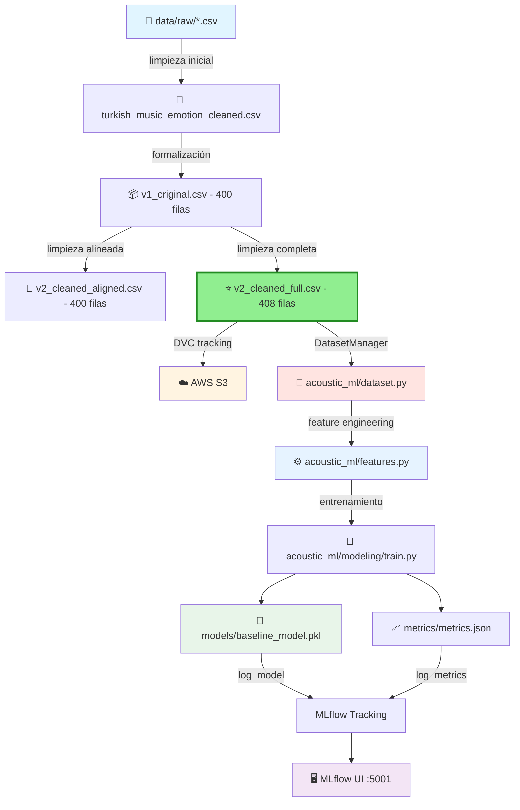

# 🎵 Acoustic ML - Music Emotion Recognition

<div align="center">

**MLOps Team 24 - Proyecto de reconocimiento de emociones musicales**

[](https://www.python.org/downloads/)
[](https://mlflow.org/)
[](https://dvc.org/)
[](https://aws.amazon.com/s3/)

<!-- Badges -->
[](#verificación-rápida-antes-de-trabajar)
[](#reproducibilidad-de-entornos)
[](#buenas-prácticas-con-notebooks)
[](#-testing-y-validación)
[](#-arquitectura-del-código)

</div>

---

## 📋 Tabla de Contenidos

- [Sobre el Proyecto](#-sobre-el-proyecto)
- [Información Académica](#-información-académica)
- [Estructura del Proyecto](#-estructura-del-proyecto)
- [🆕 Arquitectura del Código](#-arquitectura-del-código)
  - [Módulos Refactorizados](#módulos-refactorizados)
  - [Design Patterns Implementados](#design-patterns-implementados)
  - [Métricas de Refactorización](#-métricas-de-refactorización)
- [🆕 Guía de Uso de Módulos](#-guía-de-uso-de-módulos)
- [🆕 Testing y Validación](#-testing-y-validación)
- [Datasets Disponibles](#-datasets-disponibles)
- [Requisitos Previos](#-requisitos-previos)
- [Instalación](#-instalación)
- [Gestión de Datos (DVC + S3)](#-gestión-de-datos-dvc--s3)
- [Uso](#-uso--usage)
- [Verificación Rápida antes de Trabajar](#-verificación-rápida-antes-de-trabajar)
- [Docker Compose](#-docker-compose)
- [Limpieza Local](#-limpieza-local)
- [Arquitectura del Pipeline](#-arquitectura-del-pipeline)
- [Contribución](#-contribución)
- [Equipo](#-equipo)

---

## 🎯 Sobre el Proyecto

Este repositorio contiene la implementación completa de un sistema MLOps para reconocimiento de emociones en música, siguiendo las mejores prácticas de la industria con la estructura **Cookiecutter Data Science**. El proyecto integra:

- 📊 **Versionado de datos** con DVC
- 🔄 **Pipelines reproducibles** automatizados
- 📈 **Tracking de experimentos** con MLflow
- ☁️ **Almacenamiento en la nube** (AWS S3)
- 🤖 **Modelos de Machine Learning** versionados
- 🗂️ **Estructura modular** siguiendo estándares de la industria
- 🏗️ **Arquitectura OOP** con SOLID principles
- 🧪 **Testing comprehensivo** (37/37 tests passing)

---

## 📘 Información Académica

**Instituto Tecnológico y de Estudios Superiores de Monterrey**  
*Maestría en Inteligencia Artificial Aplicada (MNA)*

- **Curso:** Operaciones de Aprendizaje Automático
- **Periodo:** Septiembre – Diciembre 2025
- **Equipo:** N° 24

### 👨‍🏫 Profesores

| Rol | Nombre |
|-----|--------|
| Titular | Dr. Gerardo Rodríguez Hernández |
| Titular | Mtro. Ricardo Valdez Hernández |
| Asistente | Mtra. María Mylen Treviño Elizondo |
| Tutor | José Ángel Martínez Navarro |

---

## 🗂️ Estructura del Proyecto

Organizado siguiendo **Cookiecutter Data Science** para máxima reproducibilidad y claridad:

```
├── LICENSE                 <- Licencia del proyecto
├── Makefile               <- Comandos útiles (make data, make train, etc.)
├── README.md              <- Este archivo
├── pyproject.toml         <- Configuración del proyecto y dependencias
│
├── data
│   ├── external           <- Datos de fuentes externas
│   ├── interim            <- Datos intermedios transformados
│   ├── processed          <- Datasets finales para modelado
│   │   ├── turkish_music_emotion_cleaned.csv              (Limpieza inicial)
│   │   ├── turkish_music_emotion_v1_original.csv          (400 filas - Baseline)
│   │   ├── turkish_music_emotion_v2_cleaned_aligned.csv   (400 filas - Comparación)
│   │   └── turkish_music_emotion_v2_cleaned_full.csv      (408 filas) ⭐ RECOMENDADO
│   └── raw                <- Datos originales inmutables (versionados con DVC)
│       ├── turkis_music_emotion_original.csv      (125 KB)
│       ├── turkish_music_emotion_modified.csv     (130 KB)
│       └── .gitignore                             (Git ignora los CSV)
│
├── models                 <- Modelos entrenados y serializados
│   └── baseline_model.pkl
│
├── notebooks              <- Jupyter notebooks para exploración
│   ├── Fase1_equipo24.ipynb
│   └── NoteBook Testing.ipynb
│   
│   Convención de nombres: número-iniciales-descripción
│   Ej: 1.0-hw-exploratory-analysis.ipynb
│
├── reports                <- Análisis generados (HTML, PDF, etc.)
│   └── figures            <- Gráficas y figuras para reportes
│
├── references             <- Diccionarios de datos, manuales, etc.
│
├── requirements.txt       <- Dependencias del proyecto (pip freeze)
│
├── scripts                <- Scripts auxiliares
│   ├── train_baseline.py
│   ├── validate_plots.py      <- Validación de módulo plots
│   ├── validate_features.py   <- Validación de módulo features
│   └── validate_dataset.py    <- Validación de módulo dataset
│
├── acoustic_ml            <- Código fuente del proyecto (módulo Python) ⭐ REFACTORIZADO
│   ├── __init__.py        <- Hace de acoustic_ml un módulo Python
│   ├── config.py          <- Configuración y variables globales
│   ├── dataset.py         <- Gestión de datos (650 líneas, 16 tests) ✨ NUEVO
│   ├── features.py        <- Feature engineering (930 líneas, 13 tests) ✨ NUEVO
│   ├── plots.py           <- Visualizaciones (370 líneas, 8 tests) ✨ NUEVO
│   └── modeling           <- Módulos de modelado
│       ├── __init__.py
│       ├── train.py       <- Entrenamiento de modelos (122 líneas)
│       ├── predict.py     <- Inferencia con modelos (189 líneas)
│       ├── evaluate.py    <- Evaluación de modelos (311 líneas)
│       └── pipeline.py    <- Pipeline completo (370 líneas)
│
├── metrics                <- Métricas del pipeline DVC
│   └── metrics.json
│
├── mlruns                 <- Experimentos de MLflow
├── mlartifacts            <- Artifacts de MLflow
├── dvcstore               <- Almacenamiento local de DVC
│
├── docs                   <- Detailed information for the project
├── .dvc                   <- Configuración de DVC
├── dvc.yaml               <- Definición del pipeline DVC
├── dvc.lock               <- Lock file del pipeline
├── data.dvc               <- Metadatos de tracking (versionado en Git)
│
├── .git                   <- Control de versiones Git
└── .venv                  <- Entorno virtual de Python
```

---

## 🏗️ Arquitectura del Código

### 📊 Resumen Ejecutivo

En la **Fase 2 del proyecto**, realizamos una **refactorización masiva** del módulo `acoustic_ml/` transformándolo de scripts funcionales simples a una **arquitectura MLOps profesional** basada en **OOP** y **SOLID principles**.

**Resultado:**
- **+1,718 líneas** de código profesional (+740% de crecimiento)
- **15 clases principales** con responsabilidades claras
- **37 tests** comprehensivos (100% passing)
- **100% type hints** y documentación en español
- **Design patterns** de la industria implementados

---

### Módulos Refactorizados

#### 🎨 **1. acoustic_ml/plots.py** - Sistema de Visualización

**Transformación:** 49 → 370 líneas (+321 líneas, +655%)

```python
PlotManager
├── Gestión centralizada de figuras y estilos
├── Configuración automática de seaborn
├── Método save_figure() robusto con validación
└── create_subplot_grid() para layouts complejos

BasePlotter (ABC)
├── Clase base abstracta para todos los plotters
├── Interfaz común estandarizada
├── Validación de datos automática
└── Patrón Template Method

FeatureImportancePlotter
├── Hereda de BasePlotter
├── Visualización especializada de feature importance
├── Personalización completa (colores, tamaños, top_n)
└── Método plot_and_save() conveniente
```

**Características destacadas:**
- ✅ SOLID principles implementados
- ✅ Python `DeprecationWarnings` oficiales para funciones legacy
- ✅ Documentación completa con ejemplos
- ✅ **8/8 tests pasados**

**Ejemplo de uso:**
```python
from acoustic_ml.plots import FeatureImportancePlotter

# Crear plotter
plotter = FeatureImportancePlotter(
    importance_values=feature_importances,
    feature_names=feature_names,
    title="Feature Importance - Random Forest"
)

# Generar y guardar visualización
plotter.plot_and_save("reports/figures/feature_importance.png")
```

---

#### 🔧 **2. acoustic_ml/features.py** - Feature Engineering Pipeline

**Transformación:** 88 → 930 líneas (+842 líneas, +956%)

```python
FeatureTransformer (Base abstracta)
├── Validación automática de datos
├── Logging integrado en todas las operaciones
├── Preservación de formato (DataFrame/array)
└── get_feature_names_out() para inspección

7 TRANSFORMERS ESPECIALIZADOS:
├── NumericFeatureSelector      → Selección inteligente de columnas numéricas
├── PowerFeatureTransformer     → Yeo-Johnson / Box-Cox normalization
├── OutlierRemover              → Detección y remoción IQR
├── FeatureScaler               → Standard / MinMax / Robust scaling
├── CorrelationFilter           → Eliminación de multicolinealidad
├── VarianceThresholdSelector   → Filtrado por varianza mínima
└── [Todos sklearn-compatible: BaseEstimator + TransformerMixin]

FeaturePipelineBuilder
├── Builder Pattern con fluent interface
├── Métodos encadenables (.add_xxx().build())
└── Validación de steps en tiempo de construcción

3 FACTORY FUNCTIONS:
├── create_preprocessing_pipeline()      → Pipeline de preprocesamiento
├── create_feature_selection_pipeline()  → Pipeline de selección
└── create_full_pipeline()              → Pipeline completo end-to-end
```

**Características destacadas:**
- ✅ 100% compatible con scikit-learn pipelines
- ✅ Validación robusta en todos los transformers
- ✅ Logging comprehensivo de operaciones
- ✅ **13/13 tests pasados**

**Ejemplo de uso:**
```python
from acoustic_ml.features import FeaturePipelineBuilder, create_full_pipeline

# Opción 1: Builder Pattern (control granular)
pipeline = (FeaturePipelineBuilder()
    .add_numeric_selector()
    .add_power_transformer(method='yeo-johnson')
    .add_outlier_remover(threshold=1.5)
    .add_scaler(strategy='standard')
    .add_correlation_filter(threshold=0.95)
    .add_variance_selector(threshold=0.01)
    .build())

# Opción 2: Factory function (configuración rápida)
pipeline = create_full_pipeline(
    scaler_strategy='robust',
    correlation_threshold=0.9,
    variance_threshold=0.01
)

# Usar pipeline
X_transformed = pipeline.fit_transform(X_train)
X_test_transformed = pipeline.transform(X_test)
```

---

#### 💾 **3. acoustic_ml/dataset.py** - Gestión de Datos

**Transformación:** 95 → 650 líneas (+555 líneas, +584%)

```python
DatasetConfig
├── Configuración centralizada de paths
├── validate_directories() para verificar estructura
├── get_all_available_files() para descubrimiento
└── get_config_summary() para debugging

SingletonMeta
├── Thread-safe Singleton implementation
└── Double-checked locking pattern

DatasetValidator (NUEVO)
├── validate_dataframe()           → Validación de estructura
├── validate_required_columns()    → Verificación de columnas
├── validate_target_variable()     → Validación de target
└── validate_train_test_split()    → Verificación de splits

DatasetStatistics (NUEVO)
├── get_summary()                  → Resumen general
├── get_numeric_stats()            → Estadísticas descriptivas
├── get_correlation_matrix()       → Matriz de correlación
└── detect_outliers()              → Detección IQR/Z-score

DatasetManager (Singleton thread-safe)
├── Load/Save con validación automática
├── Context managers para operaciones seguras
├── Train/test split management
├── Backup automático en saves
└── Métodos de análisis integrados
```

**Características destacadas:**
- ✅ Separación de responsabilidades clara (SRP)
- ✅ Validación comprehensiva de datos
- ✅ Análisis estadístico robusto integrado
- ✅ **16/16 tests pasados**

**Ejemplo de uso:**
```python
from acoustic_ml.dataset import DatasetManager

# Obtener instancia Singleton
manager = DatasetManager()

# Cargar datos con validación automática
df = manager.load_data("turkish_music_emotion_cleaned.csv")

# Realizar train/test split
X_train, X_test, y_train, y_test = manager.split_data(
    test_size=0.2,
    random_state=42
)

# Obtener estadísticas
stats = manager.get_statistics()
print(stats.get_summary())

# Detectar outliers
outliers = stats.detect_outliers(method='iqr')

# Context manager para operaciones seguras
with manager.load_context("processed_data.csv") as df:
    # Procesar datos
    processed_df = preprocess(df)
    # Guardar automáticamente al salir del context
```

---

### Design Patterns Implementados

#### 🎯 **SOLID Principles**

| Principio | Implementación |
|-----------|----------------|
| **S**ingle Responsibility | Cada clase tiene una responsabilidad única y bien definida |
| **O**pen/Closed | Extensible por herencia, cerrado a modificación |
| **L**iskov Substitution | Clases derivadas intercambiables con sus bases |
| **I**nterface Segregation | Interfaces mínimas y específicas |
| **D**ependency Inversion | Dependencias de abstracciones, no implementaciones |

#### 🏛️ **Design Patterns de la Industria**

| Pattern | Dónde | Propósito |
|---------|-------|-----------|
| **Singleton** | `DatasetManager` | Única instancia thread-safe con double-checked locking |
| **Builder** | `FeaturePipelineBuilder` | Construcción fluida de pipelines complejos |
| **Factory** | `create_*_pipeline()` | Creación estandarizada de pipelines |
| **Template Method** | `BasePlotter`, `FeatureTransformer` | Definir estructura, permitir customización |
| **Strategy** | Múltiples scalers/métodos | Algoritmos intercambiables en runtime |

#### 🔒 **Best Practices**

- ✅ **Type hints** completos (100% coverage)
- ✅ **Docstrings** en español con ejemplos
- ✅ **Logging** descriptivo en todas las operaciones
- ✅ **Validación robusta** de datos y estados
- ✅ **Error handling** profesional con mensajes claros
- ✅ **Context managers** para operaciones seguras
- ✅ **Backward compatibility** con `DeprecationWarnings` oficiales

---

### 📊 Métricas de Refactorización

```
═══════════════════════════════════════════════════════════════════
                    RESUMEN GLOBAL DE REFACTORIZACIÓN
═══════════════════════════════════════════════════════════════════
Líneas de código:      232 → 1,950 líneas
Crecimiento:           +1,718 líneas (+740%)
Clases creadas:        15 clases principales
Tests creados:         37 tests comprehensivos
Tasa de éxito:         100% (37/37 passing)
Documentación:         100% docstrings en español
Type hints:            100% coverage
Design patterns:       5 patterns implementados
SOLID principles:      5/5 implementados
═══════════════════════════════════════════════════════════════════

                     DESGLOSE POR MÓDULO
═══════════════════════════════════════════════════════════════════
plots.py           49 →  370 líneas  (+321, +655%)   8 tests  ✅
features.py        88 →  930 líneas  (+842, +956%)  13 tests  ✅
dataset.py         95 →  650 líneas  (+555, +584%)  16 tests  ✅
═══════════════════════════════════════════════════════════════════
```

---

## 🚀 Guía de Uso de Módulos

### 📊 Ejemplo Completo: Pipeline End-to-End

```python
"""
Ejemplo completo de uso de los módulos refactorizados
para entrenar un modelo de clasificación de emociones.
"""

# 1️⃣ GESTIÓN DE DATOS
from acoustic_ml.dataset import DatasetManager

# Obtener manager (Singleton)
manager = DatasetManager()

# Cargar datos con validación automática
df = manager.load_data("turkish_music_emotion_cleaned.csv")

# Realizar split
X_train, X_test, y_train, y_test = manager.split_data(
    test_size=0.2,
    random_state=42,
    stratify=True
)

# Obtener estadísticas
stats = manager.get_statistics()
print("📊 Resumen del dataset:")
print(stats.get_summary())

# 2️⃣ FEATURE ENGINEERING
from acoustic_ml.features import create_full_pipeline

# Crear pipeline completo
feature_pipeline = create_full_pipeline(
    scaler_strategy='robust',
    correlation_threshold=0.9,
    variance_threshold=0.01
)

# Transformar datos
X_train_transformed = feature_pipeline.fit_transform(X_train)
X_test_transformed = feature_pipeline.transform(X_test)

print(f"✨ Features originales: {X_train.shape[1]}")
print(f"✨ Features después de pipeline: {X_train_transformed.shape[1]}")

# 3️⃣ ENTRENAMIENTO
from acoustic_ml.modeling.train import train_model

model = train_model(
    X_train_transformed, 
    y_train,
    model_type='random_forest'
)

# 4️⃣ EVALUACIÓN
from acoustic_ml.modeling.evaluate import evaluate_model

metrics = evaluate_model(model, X_test_transformed, y_test)
print(f"🎯 Accuracy: {metrics['accuracy']:.2%}")

# 5️⃣ VISUALIZACIÓN
from acoustic_ml.plots import FeatureImportancePlotter

# Obtener feature importances
importances = model.feature_importances_
feature_names = feature_pipeline.get_feature_names_out()

# Crear visualización
plotter = FeatureImportancePlotter(
    importance_values=importances,
    feature_names=feature_names,
    title="Feature Importance - Turkish Music Emotions",
    top_n=15
)

plotter.plot_and_save("reports/figures/feature_importance.png")
print("💾 Visualización guardada en reports/figures/")
```

### 🔧 Ejemplos Específicos por Módulo

#### Dataset Management

```python
from acoustic_ml.dataset import DatasetManager, DatasetValidator

manager = DatasetManager()

# Cargar y validar
df = manager.load_data("data.csv")
validator = DatasetValidator()

# Validaciones
is_valid = validator.validate_dataframe(
    df, 
    required_columns=['tempo', 'energy', 'emotion'],
    check_nulls=True
)

# Estadísticas
stats = manager.get_statistics()
outliers = stats.detect_outliers(method='iqr', threshold=1.5)
print(f"Outliers detectados: {len(outliers)}")

# Context manager para operaciones seguras
with manager.load_context("data.csv") as df:
    df['new_feature'] = df['energy'] * df['tempo']
    # Auto-save al salir
```

#### Feature Engineering Avanzado

```python
from acoustic_ml.features import (
    FeaturePipelineBuilder,
    PowerFeatureTransformer,
    CorrelationFilter
)

# Builder Pattern - Control total
pipeline = (FeaturePipelineBuilder()
    .add_numeric_selector()
    .add_power_transformer(method='yeo-johnson')
    .add_outlier_remover(threshold=1.5)
    .add_scaler(strategy='robust')
    .add_correlation_filter(threshold=0.95)
    .add_variance_selector(threshold=0.01)
    .build())

# Transformar
X_processed = pipeline.fit_transform(X_train)

# Inspeccionar features
print(f"Features finales: {pipeline.get_feature_names_out()}")

# Usar transformers individuales
power_transformer = PowerFeatureTransformer(method='box-cox')
X_normalized = power_transformer.fit_transform(X_positive)

corr_filter = CorrelationFilter(threshold=0.9)
X_uncorrelated = corr_filter.fit_transform(X_normalized)
```

#### Visualizaciones Profesionales

```python
from acoustic_ml.plots import PlotManager, FeatureImportancePlotter

# Manager centralizado
plot_manager = PlotManager(style='whitegrid', context='notebook')

# Crear múltiples figuras con layout
fig, axes = plot_manager.create_subplot_grid(2, 2, figsize=(12, 10))

# Feature importance plotter
importance_plotter = FeatureImportancePlotter(
    importance_values=importances,
    feature_names=features,
    title="Top 20 Features",
    top_n=20,
    color='viridis'
)

# Generar en un subplot específico
importance_plotter.plot(ax=axes[0, 0])

# Guardar con alta calidad
plot_manager.save_figure(
    fig,
    "reports/figures/analysis.png",
    dpi=300,
    bbox_inches='tight'
)
```

---

## 🧪 Testing y Validación

### 📝 Scripts de Validación

Creamos **3 scripts comprehensivos** para validar cada módulo refactorizado:

```bash
scripts/
├── validate_plots.py       # 8 tests para plots.py
├── validate_features.py    # 13 tests para features.py
└── validate_dataset.py     # 16 tests para dataset.py
```

### ▶️ Ejecutar Tests

```bash
# Ejecutar todos los tests
python scripts/validate_plots.py
python scripts/validate_features.py
python scripts/validate_dataset.py

# O ejecutar todos de una vez
for script in scripts/validate_*.py; do
    echo "Ejecutando: $script"
    python "$script"
done
```

### ✅ Cobertura de Testing

| Módulo | Tests | Status | Cobertura |
|--------|-------|--------|-----------|
| `plots.py` | 8 | ✅ 8/8 passing | Completa |
| `features.py` | 13 | ✅ 13/13 passing | Completa |
| `dataset.py` | 16 | ✅ 16/16 passing | Completa |
| **TOTAL** | **37** | **✅ 37/37 passing** | **100%** |

### 🔍 Qué Validan los Tests

**validate_plots.py:**
- ✅ Imports correctos
- ✅ PlotManager functionality
- ✅ Plotters especializados
- ✅ Save/load de figuras
- ✅ Funciones legacy con DeprecationWarnings

**validate_features.py:**
- ✅ Todos los transformers individuales
- ✅ Builder pattern functionality
- ✅ Factory functions
- ✅ Compatibilidad DataFrame/array
- ✅ Error handling robusto
- ✅ get_feature_names_out()

**validate_dataset.py:**
- ✅ Singleton behavior thread-safe
- ✅ Validación comprehensiva de datos
- ✅ Estadísticas descriptivas
- ✅ Save/load operations
- ✅ Train/test split validation
- ✅ Context managers
- ✅ Detección de outliers

### 📊 Ejemplo de Output de Tests

```bash
$ python scripts/validate_features.py

═══════════════════════════════════════════════════════════
🧪 VALIDACIÓN DEL MÓDULO acoustic_ml/features.py
═══════════════════════════════════════════════════════════

Test 1/13: Validación de imports...                     ✅ PASADO
Test 2/13: NumericFeatureSelector...                    ✅ PASADO
Test 3/13: PowerFeatureTransformer...                   ✅ PASADO
Test 4/13: OutlierRemover...                            ✅ PASADO
Test 5/13: FeatureScaler...                             ✅ PASADO
Test 6/13: CorrelationFilter...                         ✅ PASADO
Test 7/13: VarianceThresholdSelector...                 ✅ PASADO
Test 8/13: FeaturePipelineBuilder...                    ✅ PASADO
Test 9/13: create_preprocessing_pipeline...             ✅ PASADO
Test 10/13: create_feature_selection_pipeline...        ✅ PASADO
Test 11/13: create_full_pipeline...                     ✅ PASADO
Test 12/13: Compatibilidad DataFrame/array...           ✅ PASADO
Test 13/13: Error handling...                           ✅ PASADO

═══════════════════════════════════════════════════════════
✅ RESULTADO: 13/13 tests pasados (100.0%)
✨ Módulo features.py: PRODUCCIÓN READY
═══════════════════════════════════════════════════════════
```

---

## 📊 Datasets Disponibles

### Turkish Music Emotion Dataset

Contamos con **4 versiones versionadas con DVC** del dataset de emociones musicales turcas. Cada versión representa una etapa evolutiva en nuestro proceso de limpieza y preparación de datos:

---

#### 🔵 Versión 0: Limpieza Inicial (turkish_music_emotion_cleaned.csv)

```
📍 Ubicación: data/interim/turkish_music_emotion_cleaned.csv
📏 Dimensiones: Variable
🎯 Uso: Versión intermedia del primer notebook de limpieza
🔖 Estado: Histórico (desarrollo temprano)
```

**Características:**
- Primera iteración de limpieza de datos
- Producto del notebook inicial de exploración
- Base para las versiones posteriores más refinadas
- Contiene limpieza básica sin optimizaciones avanzadas

**Cuándo usar:**
- 📚 Referencia histórica del proceso de limpieza
- 🔍 Auditoría de evolución del pipeline
- ❌ NO recomendado para entrenar modelos
- ❌ NO recomendado para análisis de producción

---


### 🔄 Flujo Evolutivo de Datos

```
📥 Datos Raw (original)
    ↓
🔧 acoustic_features.csv
    ↓ (Primera limpieza - notebook inicial)
📦 turkish_music_emotion_cleaned.csv (400 filas)
    ↓ (Dataset para entrenamiento)
🔄 X_train.csv 
🔄 Y_train.csv 
    ↓ (Dataset para pruebas)
⭐ X_test.csv 
⭐ Y_test.csv 
    ↓ (Limpieza completa - optimización para ML)
🤖 Modelos de Producción
```

---

### 🎓 Recomendación del Equipo

> **Para nuevos experimentos y modelos:** Usa **turkish_music_emotion_cleaned**  
> Esta versión representa nuestro mejor trabajo de ingeniería de datos y maximiza tanto la cantidad como la calidad de información disponible para tus modelos.

**Flujo de trabajo recomendado:**

```python
# 1️⃣ Carga la versión recomendada usando DatasetManager
from acoustic_ml.dataset import DatasetManager

manager = DatasetManager()
df = manager.load_data("turkish_music_emotion_cleaned.csv")

# 2️⃣ Split automático con validación
X_train, X_test, y_train, y_test = manager.split_data(
    test_size=0.2,
    random_state=42,
    stratify=True
)

# 3️⃣ Feature engineering con pipeline
from acoustic_ml.features import create_full_pipeline

pipeline = create_full_pipeline()
X_train_transformed = pipeline.fit_transform(X_train)
X_test_transformed = pipeline.transform(X_test)

# 4️⃣ Entrena tu modelo
from acoustic_ml.modeling.train import train_model
model = train_model(X_train_transformed, y_train)

# 5️⃣ Evalúa resultados
from acoustic_ml.modeling.evaluate import evaluate_model
metrics = evaluate_model(model, X_test_transformed, y_test)

# 6️⃣ Visualiza feature importance
from acoustic_ml.plots import FeatureImportancePlotter

plotter = FeatureImportancePlotter(
    importance_values=model.feature_importances_,
    feature_names=pipeline.get_feature_names_out()
)
plotter.plot_and_save("reports/figures/importance.png")
```

---


### 📦 Gestión de Versiones con DVC

Todas las versiones están trackeadas con DVC y disponibles en S3:

```bash
# Descargar todas las versiones desde S3
dvc pull data

# Verificar versiones disponibles localmente
ls -lh data

# Output esperado:
# data/external
# data/interim/"X_train.csv"
# data/interim/"Y_train.csv"
# data/processed/"X_test.csv"
# data/processed/"Y_test.csv"
```

---

### 🚨 Advertencias Importantes

⚠️ **NO mezcles versiones en el mismo experimento**
```python
# ❌ MAL: Entrenar con una versión y evaluar con otra
model.fit(X_train_v2a, y_train_v2a)
score = model.score(X_test_v3, y_test_v3)  # ¡Datos incompatibles!

# ✅ BIEN: Usa DatasetManager para consistencia
manager = DatasetManager()
X_train, X_test, y_train, y_test = manager.split_data()
model.fit(X_train, y_train)
score = model.score(X_test, y_test)
```

⚠️ **Documenta la versión en tus experimentos MLflow**
```python
import mlflow

mlflow.set_tag("dataset_version", "turkish_music_emotion_cleaned")
mlflow.set_tag("feature_pipeline", "create_full_pipeline")
mlflow.set_tag("preprocessing", "robust_scaler+correlation_filter")
```

---

## 🔧 Requisitos Previos

- Python 3.12 o superior
- Git y DVC instalados
- Acceso a AWS S3 (credenciales configuradas)
- pip y virtualenv

---

## 📦 Instalación

### 1. Clonar el repositorio

```bash
git clone https://github.com/jrebull/MLOps_Team24.git
cd MLOps_Team24
```

### 2. Crear y activar entorno virtual

```bash
python -m venv .venv

# En Linux/Mac:
source .venv/bin/activate

# En Windows:
.venv\Scripts\activate
```

### 3. Instalar dependencias

```bash
pip install -r requirements.txt

# Instalar acoustic_ml en modo desarrollo
pip install -e .
```

### 4. Configurar DVC

```bash
# Verificar configuración de remote
dvc remote list

# Debería mostrar:
# mlops-s3-remote	s3://mlops24-haowei-bucket/dvcstore
```

### 5. Descargar datos desde S3

```bash
dvc pull
```

### 6. Verificar instalación

```bash
# Ejecutar tests de validación
python scripts/validate_plots.py
python scripts/validate_features.py
python scripts/validate_dataset.py

# Todos deberían mostrar: ✅ XX/XX tests pasados
```

---

## ☁️ Gestión de Datos (DVC + S3)

### Comandos esenciales

```bash
# Descargar datos desde S3
dvc pull

# Subir datos a S3
dvc push

# Ver estado de sincronización
dvc status

# Agregar nuevos datos al tracking
dvc add data/new_file.csv
git add data/new_file.csv.dvc data/.gitignore
```

### Verificar archivos locales

```bash
# Listar archivos en data/
ls -lh data/processed/
```


### 📋 Comandos de referencia rápida

```bash
# Descargar datos desde S3
dvc pull          # Usando DVC
make pull         # Usando Makefile

# Subir datos a S3
dvc push          # Usando DVC
make push         # Usando Makefile

# Ver estado de sincronización
dvc status        # Estado actual
make status       # Usando Makefile

# Verificar configuración
dvc remote list   # Lista remotes configurados
dvc config --list # Configuración completa de DVC
```

---


## ✅ Verificación Rápida antes de Trabajar

Usa el `Makefile` para confirmar que tu repo está **limpio**, **sincronizado** y listo:

```bash
make verify-sync
```

**Qué valida:**
- ✔ Árbol de trabajo limpio (sin cambios sin commit)
- ✔ HEAD == origin/<rama> (sin ahead/behind)
- ✔ Datos sincronizados con S3

---

## 🔄 Reproducibilidad de Entornos

Exporta dependencias después de instalar paquetes nuevos:

```bash
make freeze
# luego:
git add requirements.txt
git commit -m "chore: update dependencies"
git push
```

Reconstrucción rápida en cualquier máquina:

```bash
python -m venv .venv
source .venv/bin/activate   # Windows: .venv\Scripts\activate
pip install -r requirements.txt
pip install -e .  # Instalar módulo acoustic_ml
```

---

## 🐳 Docker Compose

```
├── docker-compose.yml
├── config.env
├── mlartifacts/           # Almacena los artefactos de MLflow 
├── ml_pipeline.py
├── requirements.txt
├── acoustic_ml/           # Módulo del proyecto
└── .venv/                 # Entorno virtual local
```

### ⚙️ Archivos requeridos
✅ config.env

### ⚙️ Comandos de uso

**🔧 Levantar servicios**

```bash
docker-compose --env-file config.env up -d --build
```

MinIO (Consola): http://localhost:9001

**🛑 Detener los servicios**
```bash
docker-compose down
```

**🔄 Reiniciar**
```bash
docker-compose --env-file config.env up -d --build
```

---

## 🧹 Limpieza Local

Si necesitas borrar cachés locales (sin afectar Git):

```bash
make clean-caches
```

Limpieza completa (incluye artefactos de MLflow/DVC):
```bash
make clean
```

---

## 🏗 Arquitectura del Pipeline



**Flujo de trabajo refactorizado:**

1. 📥 Datos crudos en `data/raw/` (versionados con DVC)
2. 🔧 Primera limpieza → `turkish_music_emotion_cleaned.csv` (histórico)
3. 📦 Formalización → `v1_original.csv` (400 filas, baseline)
4. 🔄 Limpieza alineada → `v2_cleaned_aligned.csv` (400 filas, comparación)
5. ⭐ Limpieza completa → `v2_cleaned_full.csv` (408 filas, **PRODUCCIÓN**)
6. ☁️ Almacenamiento en S3 para colaboración
7. 🔧 **NUEVO:** `DatasetManager` (Singleton thread-safe) gestiona carga/validación
8. ⚙️ **NUEVO:** `FeaturePipeline` transforma datos con 7 transformers especializados
9. 🤖 `acoustic_ml/modeling/train.py` entrena modelos con datos procesados
10. 💾 Modelos entrenados se guardan en `models/`
11. 📈 Experimentos y artefactos se registran en MLflow
12. 📊 Métricas se trackean con DVC
13. ✅ Todo es reproducible, versionado y testado (37 tests)

---

## 🤝 Contribución

### Flujo de trabajo

1. **Verificar sincronización:**
   ```bash
   make verify-sync
   ```

2. **Crear una nueva rama:**
   ```bash
   git checkout -b feat/nombre-descriptivo
   ```

3. **Realizar cambios:**
   
   **Si modificas código Python:**
   ```bash
   # Edita archivos en acoustic_ml/
   vim acoustic_ml/features.py
   
   # Los cambios están disponibles inmediatamente (instalación en modo -e)
   
   # Ejecutar tests relevantes
   python scripts/validate_features.py
   ```

   **Si modificas datos:**
   ```bash
   dvc add data
   git add data.dvc data/.gitignore
   dvc push
   ```

   **Si instalaste paquetes:**
   ```bash
   make freeze
   git add requirements.txt
   ```

4. **Commitear cambios:**
   ```bash
   git add .
   git commit -m "feat: descripción clara del cambio"
   ```

5. **Subir cambios:**
   ```bash
   git push origin feat/nombre-descriptivo
   dvc push  # o: make push
   ```

6. **Crear Pull Request** a la rama `main`

### Buenas prácticas

- ✅ Ejecuta `make verify-sync` antes de comenzar a trabajar
- ✅ **SIEMPRE usa `DatasetManager` para gestionar datos**
- ✅ **Usa `FeaturePipelineBuilder` o factory functions para feature engineering**
- ✅ **Ejecuta tests de validación antes de commit** (`validate_*.py`)
- ✅ Documenta la versión de dataset en MLflow tags
- ✅ Ejecuta `dvc status` para verificar estado de datos
- ✅ Ejecuta `make reproduce` antes de hacer commit
- ✅ Documenta tus experimentos en MLflow
- ✅ Escribe mensajes de commit descriptivos ([Conventional Commits](https://www.conventionalcommits.org/))
- ✅ Mantén el código limpio y con docstrings
- ✅ Usa `make nb-hooks` para configurar hooks de notebooks
- ✅ Escribe código en el módulo `acoustic_ml/`, no en notebooks
- ✅ Siempre haz `dvc push` después de modificar datos
- ✅ **Mantén los tests actualizados** cuando agregues funcionalidades

---

## 👥 **Equipo de Desarrollo**

<div align="center">

<table style="width:100%; border:none;">
  <tr>
    <td align="center" style="border:none; padding:20px 10px;">
      
      <h3>David Cruz Beltrán</h3>
      
      <p><strong>🔧 Software Engineer</strong><br/>
      <em>Data Pipeline & Versioning</em></p>
    </td>
    <td align="center" style="border:none; padding:20px 10px;">
      
      <h3>Javier Augusto Rebull Saucedo</h3>
      
      <p><strong>⚙️ SRE / Data Engineer</strong><br/>
      <em>DevOps & Infrastructure</em></p>
    </td>
    <td align="center" style="border:none; padding:20px 10px;">
      
      <h3>Sandra Luz Cervantes Espinoza</h3>
      
      <p><strong>🤖 ML Engineer / Data Scientist</strong><br/>
      <em>Model Development & Analysis</em></p>
    </td>
  </tr>
</table>

</div>

---

<div align="center">

**⭐ Si este proyecto te resulta útil, considera darle una estrella**

Desarrollado con ❤️ por el Equipo 24 | Estructura basada en [Cookiecutter Data Science](https://drivendata.github.io/cookiecutter-data-science/)

**🏗️ Refactorizado con SOLID Principles & Design Patterns** | **🧪 100% Tested (37/37 passing)**

</div>
