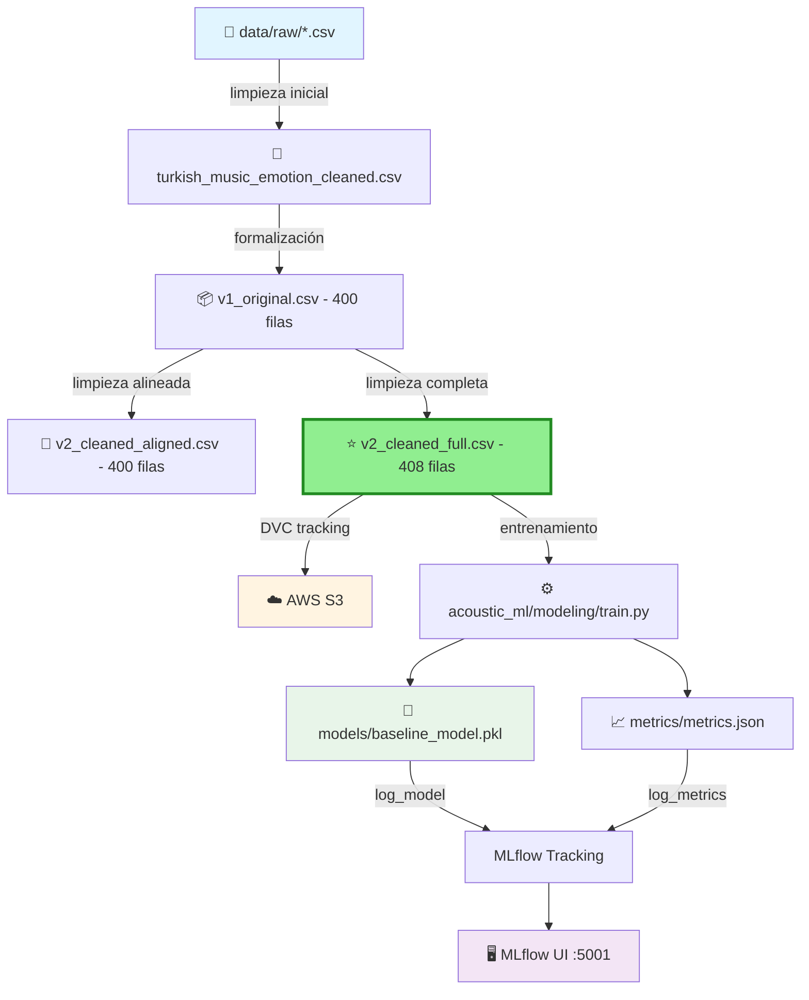

# 🎵 Acoustic ML - Music Emotion Recognition

<div align="center">

**MLOps Team 24 - Proyecto de reconocimiento de emociones musicales**

[](https://www.python.org/downloads/)
[](https://mlflow.org/)
[](https://dvc.org/)
[](https://aws.amazon.com/s3/)

<!-- Badges -->
[](#verificación-rápida-antes-de-trabajar)
[](#reproducibilidad-de-entornos)
[](#buenas-prácticas-con-notebooks)

</div>

---

## 📋 Tabla de Contenidos

- [Sobre el Proyecto](#-sobre-el-proyecto)
- [Información Académica](#-información-académica)
- [Estructura del Proyecto](#-estructura-del-proyecto)
- [Requisitos Previos](#-requisitos-previos)
- [Instalación](#-instalación)
- [Gestión de Datos (DVC + S3)](#-gestión-de-datos-dvc--s3)
- [Uso](#-uso)
- [Verificación Rápida antes de Trabajar](#-verificación-rápida-antes-de-trabajar)
- [Docker Compose](#-docker-compose)
- [Limpieza Local](#-limpieza-local)
- [Arquitectura del Pipeline](#-arquitectura-del-pipeline)
- [Contribución](#-contribución)
- [Equipo](#-equipo)

---

## 🎯 Sobre el Proyecto

Este repositorio contiene la implementación completa de un sistema MLOps para reconocimiento de emociones en música, siguiendo las mejores prácticas de la industria con la estructura **Cookiecutter Data Science**. El proyecto integra:

- 📊 **Versionado de datos** con DVC
- 🔄 **Pipelines reproducibles** automatizados
- 📈 **Tracking de experimentos** con MLflow
- ☁️ **Almacenamiento en la nube** (AWS S3)
- 🤖 **Modelos de Machine Learning** versionados
- 🗂️ **Estructura modular** siguiendo estándares de la industria

---

## 📘 Información Académica

**Instituto Tecnológico y de Estudios Superiores de Monterrey**  
*Maestría en Inteligencia Artificial Aplicada (MNA)*

- **Curso:** Operaciones de Aprendizaje Automático
- **Periodo:** Septiembre – Diciembre 2025
- **Equipo:** N° 24

### 👨‍🏫 Profesores

| Rol | Nombre |
|-----|--------|
| Titular | Dr. Gerardo Rodríguez Hernández |
| Titular | Mtro. Ricardo Valdez Hernández |
| Asistente | Mtra. María Mylen Treviño Elizondo |
| Tutor | José Ángel Martínez Navarro |

---

## 🗂️ Estructura del Proyecto

Organizado siguiendo **Cookiecutter Data Science** para máxima reproducibilidad y claridad:

```
├── LICENSE                 <- Licencia del proyecto
├── Makefile               <- Comandos útiles (make data, make train, etc.)
├── README.md              <- Este archivo
├── pyproject.toml         <- Configuración del proyecto y dependencias
│
├── data
│   ├── external           <- Datos de fuentes externas
│   ├── interim            <- Datos intermedios transformados
│   ├── processed          <- Datasets finales para modelado
│   │   ├── turkish_music_emotion_cleaned.csv              (Limpieza inicial)
│   │   ├── turkish_music_emotion_v1_original.csv          (400 filas - Baseline)
│   │   ├── turkish_music_emotion_v2_cleaned_aligned.csv   (400 filas - Comparación)
│   │   └── turkish_music_emotion_v2_cleaned_full.csv      (408 filas) ⭐ RECOMENDADO
│   └── raw                <- Datos originales inmutables (versionados con DVC)
│       ├── turkis_music_emotion_original.csv      (125 KB)
│       ├── turkish_music_emotion_modified.csv     (130 KB)
│       └── .gitignore                             (Git ignora los CSV)
│
├── models                 <- Modelos entrenados y serializados
│   └── baseline_model.pkl
│
├── notebooks              <- Jupyter notebooks para exploración
│   ├── Fase1_equipo24.ipynb
│   └── NoteBook Testing.ipynb
│   
│   Convención de nombres: número-iniciales-descripción
│   Ej: 1.0-hw-exploratory-analysis.ipynb
│
├── reports                <- Análisis generados (HTML, PDF, etc.)
│   └── figures            <- Gráficas y figuras para reportes
│
├── references             <- Diccionarios de datos, manuales, etc.
│
├── requirements.txt       <- Dependencias del proyecto (pip freeze)
│
├── scripts                <- Scripts auxiliares
│   └── train_baseline.py
│
├── acoustic_ml            <- Código fuente del proyecto (módulo Python)
│   ├── __init__.py        <- Hace de acoustic_ml un módulo Python
│   ├── config.py          <- Configuración y variables globales
│   ├── dataset.py         <- Scripts para cargar/generar datos
│   ├── features.py        <- Feature engineering
│   ├── plots.py           <- Visualizaciones
│   └── modeling           
│       ├── __init__.py
│       ├── train.py       <- Entrenamiento de modelos
│       └── predict.py     <- Inferencia con modelos
│
├── metrics                <- Métricas del pipeline DVC
│   └── metrics.json
│
├── mlruns                 <- Experimentos de MLflow
├── mlartifacts            <- Artifacts de MLflow
├── dvcstore               <- Almacenamiento local de DVC
│
├── docs                   <- Detailed information for the project
├── .dvc                   <- Configuración de DVC
├── dvc.yaml               <- Definición del pipeline DVC
├── dvc.lock               <- Lock file del pipeline
├── data.dvc               <- Metadatos de tracking (versionado en Git)
│
├── .git                   <- Control de versiones Git
└── .venv                  <- Entorno virtual de Python
```

---

## 📊 Datasets Disponibles

### Turkish Music Emotion Dataset

Contamos con **4 versiones versionadas con DVC** del dataset de emociones musicales turcas. Cada versión representa una etapa evolutiva en nuestro proceso de limpieza y preparación de datos:

---

#### 🔵 Versión 0: Limpieza Inicial (turkish_music_emotion_cleaned.csv)

```
📍 Ubicación: data/interim/turkish_music_emotion_cleaned.csv
📏 Dimensiones: Variable
🎯 Uso: Versión intermedia del primer notebook de limpieza
🔖 Estado: Histórico (desarrollo temprano)
```

**Características:**
- Primera iteración de limpieza de datos
- Producto del notebook inicial de exploración
- Base para las versiones posteriores más refinadas
- Contiene limpieza básica sin optimizaciones avanzadas

**Cuándo usar:**
- 📚 Referencia histórica del proceso de limpieza
- 🔍 Auditoría de evolución del pipeline
- ❌ NO recomendado para entrenar modelos
- ❌ NO recomendado para análisis de producción

---


### 🔄 Flujo Evolutivo de Datos

```
📥 Datos Raw (original)
    ↓
🔧 acoustic_features.csv
    ↓ (Primera limpieza - notebook inicial)
📦 turkish_music_emotion_cleaned.csv (400 filas)
    ↓ (Dataset para entrenamiento)
🔄 X_train.csv 
🔄 Y_train.csv 
    ↓ (Dataset para pruebas)
⭐ X_test.csv 
⭐ Y_test.csv 
    ↓ (Limpieza completa - optimización para ML)
🤖 Modelos de Producción
```

---

### 🎓 Recomendación del Equipo

> **Para nuevos experimentos y modelos:** Usa **turkish_music_emotion_cleaned**  
> Esta versión representa nuestro mejor trabajo de ingeniería de datos y maximiza tanto la cantidad como la calidad de información disponible para tus modelos.

**Flujo de trabajo recomendado:**

```python
# 1️⃣ Carga la versión recomendada
from acoustic_ml.dataset import load_processed_data
df = load_processed_data("turkish_music_emotion_cleaned.csv")

# 2️⃣ Entrena tu modelo
from acoustic_ml.modeling.train import train_model
model = train_model(X_train, y_train)

# 3️⃣ Evalúa resultados
from acoustic_ml.modeling.evaluate import evaluate_model
metrics = evaluate_model(model, X_test, y_test)

# 4️⃣ (Opcional) Compara con versiones anteriores
df_v1 = load_processed_data("acoustic_features.csv")
df_v2a = load_processed_data("turkish_music_emotion_cleaned.csv")
# Analiza diferencias y mejoras obtenidas
```

---


### 📦 Gestión de Versiones con DVC

Todas las versiones están trackeadas con DVC y disponibles en S3:

```bash
# Descargar todas las versiones desde S3
dvc pull data

# Verificar versiones disponibles localmente
ls -lh data

# Output esperado:
# data/external
# data/interim/"X_train.csv"
# data/interim/"Y_train.csv"
# data/processed/"X_test.csv"
# data/processed/"Y_test.csv"
```

---

### 🚨 Advertencias Importantes

⚠️ **NO mezcles versiones en el mismo experimento**
```python
# ❌ MAL: Entrenar con una versión y evaluar con otra
model.fit(X_train_v2a, y_train_v2a)
score = model.score(X_test_v3, y_test_v3)  # ¡Datos incompatibles!

# ✅ BIEN: Usa la misma versión en todo el pipeline
df = load_processed_data("turkish_music_emotion_cleaned.csv")
X_train, X_test, y_train, y_test = train_test_split(df)
model.fit(X_train, y_train)
score = model.score(X_test, y_test)
```

⚠️ **Documenta la versión en tus experimentos MLflow**
```python
import mlflow

mlflow.set_tag("dataset_version", "turkish_music_emotion_cleaned")
mlflow.set_tag("dataset_rows", 408)
mlflow.set_tag("dataset_file", "turkish_music_emotion_cleaned.csv")
```

⚠️ **Mantén consistencia en notebooks**
```python
# Agrega esto al inicio de cada notebook
DATASET_VERSION = "turkish_music_emotion_cleaned.csv"  
# ⭐ RECOMENDADO
print(f"📊 Usando dataset: {DATASET_VERSION}")

df = load_processed_data(DATASET_VERSION)
```

---

## 🛠 Requisitos Previos

Antes de comenzar, asegúrate de tener instalado:

- **Python 3.12**
- **Git**
- **Make** (incluido en macOS/Linux; en Windows usar Git Bash)
- **Credenciales de AWS** configuradas

---

## 🚀 Instalación

### 1. Clonar el repositorio

```bash
git clone https://github.com/jrebull/MLOps_Team24.git
cd MLOps_Team24
```

### 2. Configurar entorno virtual

```bash
python -m venv .venv
source .venv/bin/activate  # En Windows: .venv\Scripts\activate
pip install -r requirements.txt
```

### 3. Instalar el módulo acoustic_ml en modo desarrollo

```bash
pip install -e .
```

Esto permite importar el módulo desde cualquier lugar:
```python
from acoustic_ml.dataset import load_raw_data
from acoustic_ml.modeling.train import train_model
```

### 4. Configurar AWS (CRÍTICO)

Crea o edita el archivo `~/.aws/credentials`:

```ini
[default]
aws_access_key_id = TU_ACCESS_KEY_ID
aws_secret_access_key = TU_SECRET_ACCESS_KEY
region = us-east-1
```

**Verificar configuración:**
```bash
aws s3 ls s3://mlops24-haowei-bucket/
```

### 5. Descargar datos y modelos

```bash
dvc pull
# o usando make:
make pull
```

### 6. Verificar instalación

```bash
# Verificar módulo
python -c "import acoustic_ml; print(acoustic_ml.__version__)"

# Verificar datos procesados (deberías ver las 4 versiones)
ls -lh data/processed/

# Verificar DVC
dvc status
```

---

## 📦 Gestión de Datos (DVC + S3)

### 🎯 ¿Dónde están los datos?

Los datasets **NO** están en Git (buena práctica de MLOps). Están versionados con **DVC** y almacenados en **AWS S3**.

**Estructura de almacenamiento:**

```
📁 Local (tu máquina):
MLOps_Team24/
├── data/
│   ├── processed/
│   │   ├── turkish_music_emotion_cleaned.csv              (Histórico)
│   │   ├── turkish_music_emotion_v1_original.csv          (400 filas)
│   │   ├── turkish_music_emotion_v2_cleaned_aligned.csv   (400 filas)
│   │   └── turkish_music_emotion_v2_cleaned_full.csv      (408 filas) ⭐
│   └── raw/
│       ├── turkis_music_emotion_original.csv   (125 KB)
│       ├── turkish_music_emotion_modified.csv  (130 KB)
│       └── .gitignore  ← Git ignora los CSV
└── data.dvc  ← Metadatos de tracking

☁️ AWS S3 (mlops24-haowei-bucket):
s3://mlops24-haowei-bucket/
└── files/md5/
    ├── ae/5f16bc9e...  ← turkish_music_emotion_modified.csv (130 KB)
    ├── fe/09496b4b...  ← turkis_music_emotion_original.csv (125 KB)
    ├── xx/xxxxxxxx...  ← v1_original.csv (400 filas)
    ├── yy/yyyyyyyy...  ← v2_cleaned_aligned.csv (400 filas)
    ├── zz/zzzzzzzz...  ← v2_cleaned_full.csv (408 filas)
    └── aa/a8c3e8fe...  ← Metadatos de DVC (642 Bytes)

🙂 GitHub:
MLOps_Team24/
└── data.dvc  ← Solo metadatos (~100 bytes, NO los CSV)
```

### 📥 Descargar los datos (Primera vez)

Si acabas de clonar el repositorio:

```bash
# 1. Configura AWS (solo la primera vez)
aws configure
# Ingresa: Access Key, Secret Key, Region (us-east-1)

# 2. Verifica conexión a S3
aws s3 ls s3://mlops24-haowei-bucket/

# 3. Descarga los datos desde S3
dvc pull
# o usando make:
make pull

# 4. Verifica que llegaron (deberías ver las 4 versiones)
ls -lh data/processed/
```


### 📋 Comandos de referencia rápida

```bash
# Descargar datos desde S3
dvc pull          # Usando DVC
make pull         # Usando Makefile

# Subir datos a S3
dvc push          # Usando DVC
make push         # Usando Makefile

# Ver estado de sincronización
dvc status        # Estado actual
make status       # Usando Makefile

# Verificar configuración
dvc remote list   # Lista remotes configurados
dvc config --list # Configuración completa de DVC
```

---


## 🚀 Uso

### Quick Start

Una vez instalado el proyecto, sigue estos pasos para empezar a trabajar:

#### 1️⃣ Sincronizar datos desde S3
```bash
# Descargar todos los datos versionados
dvc pull

# O usando el Makefile
make pull

# Verificar que los datos llegaron
ls -lh data/processed/
```

#### 2️⃣ Entrenar un modelo
```bash
# Opción A: Usando el script de entrenamiento
python scripts/train_baseline.py

# Opción B: Usando el módulo directamente
python -m acoustic_ml.modeling.train

# Opción C: Usando el Makefile
make train
```

#### 3️⃣ Ver experimentos en MLflow
```bash
# Iniciar la interfaz web de MLflow
mlflow ui

# Abrir en el navegador: http://localhost:5000
```

#### 4️⃣ Ejecutar notebooks de exploración
```bash
# Iniciar Jupyter
jupyter notebook

# Abrir cualquier notebook en notebooks/
# Recomendado empezar con: 1.0-team-eda-turkish-music.ipynb
```

#### 5️⃣ Reproducir el pipeline completo
```bash
# Ejecutar todo el pipeline de DVC
dvc repro

# O usando el Makefile
make reproduce
```

### Flujo de Trabajo Típico

```bash
# 1. Verificar sincronización
make verify-sync

# 2. Descargar datos actualizados
dvc pull

# 3. Explorar datos (notebooks/)
jupyter notebook

# 4. Experimentar con modelos
python scripts/train_baseline.py

# 5. Ver resultados en MLflow
mlflow ui

# 6. Si los resultados son buenos, guardar cambios
git add .
git commit -m "feat: improved model performance"
git push
```

### Comandos Útiles

```bash
# Gestión de datos
dvc pull              # Descargar datos desde S3
dvc push              # Subir cambios de datos a S3
dvc status            # Ver estado de sincronización

# MLflow
mlflow ui             # Abrir interfaz de experimentos
mlflow experiments list  # Listar experimentos

# Desarrollo
make train            # Entrenar modelo
make reproduce        # Reproducir pipeline completo
make verify-sync      # Verificar estado del repo
make freeze           # Actualizar requirements.txt

# Limpieza
make clean-caches     # Limpiar cachés
make clean            # Limpieza completa
```

### Usar el módulo `acoustic_ml` en tu código

```python
# Cargar datos procesados
from acoustic_ml.dataset import load_processed_data
df = load_processed_data("turkish_music_emotion_cleaned.csv")

# Entrenar un modelo
from acoustic_ml.modeling.train import train_model
model = train_model(X_train, y_train)

# Hacer predicciones
from acoustic_ml.modeling.predict import predict
predictions = predict(model, X_test)

# Crear visualizaciones
from acoustic_ml.plots import plot_confusion_matrix
plot_confusion_matrix(y_true, y_pred, save_path="reports/figures/cm.png")
```

---


## ✅ Verificación Rápida antes de Trabajar

Usa el `Makefile` para confirmar que tu repo está **limpio**, **sincronizado** y listo:

```bash
make verify-sync
```

**Qué valida:**
- ✔ Árbol de trabajo limpio (sin cambios sin commit)
- ✔ HEAD == origin/<rama> (sin ahead/behind)
- ✔ Datos sincronizados con S3

---

## 🔄 Reproducibilidad de Entornos

Exporta dependencias después de instalar paquetes nuevos:

```bash
make freeze
# luego:
git add requirements.txt
git commit -m "chore: update dependencies"
git push
```

Reconstrucción rápida en cualquier máquina:

```bash
python -m venv .venv
source .venv/bin/activate   # Windows: .venv\Scripts\activate
pip install -r requirements.txt
pip install -e .  # Instalar módulo acoustic_ml
```

---

## 🐳 Docker Compose

```
├── docker-compose.yml
├── config.env
├── mlartifacts/           # Almacena los artefactos de MLflow 
├── ml_pipeline.py
├── requirements.txt
├── acoustic_ml/           # Módulo del proyecto
└── .venv/                 # Entorno virtual local
```

### ⚙️ Archivos requeridos
✅ config.env

### ⚙️ Comandos de uso

**🔧 Levantar servicios**

```bash
docker-compose --env-file config.env up -d --build
```

MinIO (Consola): http://localhost:9001

**🛑 Detener los servicios**
```bash
docker-compose down
```

**🔄 Reiniciar**
```bash
docker-compose --env-file config.env up -d --build
```

---

## 🧹 Limpieza Local

Si necesitas borrar cachés locales (sin afectar Git):

```bash
make clean-caches
```

Limpieza completa (incluye artefactos de MLflow/DVC):
```bash
make clean
```

---

## 🏗 Arquitectura del Pipeline



**Flujo de trabajo:**

1. 📥 Datos crudos en `data/raw/` (versionados con DVC)
2. 🔧 Primera limpieza → `turkish_music_emotion_cleaned.csv` (histórico)
3. 📦 Formalización → `v1_original.csv` (400 filas, baseline)
4. 🔄 Limpieza alineada → `v2_cleaned_aligned.csv` (400 filas, comparación)
5. ⭐ Limpieza completa → `v2_cleaned_full.csv` (408 filas, **PRODUCCIÓN**)
6. ☁️ Almacenamiento en S3 para colaboración
7. ⚙️ El módulo `acoustic_ml` entrena modelos con v2_cleaned_full
8. 🤖 Modelos entrenados se guardan en `models/`
9. 📈 Experimentos y artefactos se registran en MLflow
10. 📊 Métricas se trackean con DVC
11. ✅ Todo es reproducible y trazable

---

## 🤝 Contribución

### Flujo de trabajo

1. **Verificar sincronización:**
   ```bash
   make verify-sync
   ```

2. **Crear una nueva rama:**
   ```bash
   git checkout -b feat/nombre-descriptivo
   ```

3. **Realizar cambios:**
   
   **Si modificas código Python:**
   ```bash
   # Edita archivos en acoustic_ml/
   vim acoustic_ml/features.py
   
   # Los cambios están disponibles inmediatamente (instalación en modo -e)
   ```

   **Si modificas datos:**
   ```bash
   dvc add data
   git add data.dvc data/.gitignore
   dvc push
   ```

   **Si instalaste paquetes:**
   ```bash
   make freeze
   git add requirements.txt
   ```

4. **Commitear cambios:**
   ```bash
   git add .
   git commit -m "feat: descripción clara del cambio"
   ```

5. **Subir cambios:**
   ```bash
   git push origin feat/nombre-descriptivo
   dvc push  # o: make push
   ```

6. **Crear Pull Request** a la rama `main`

### Buenas prácticas

- ✅ Ejecuta `make verify-sync` antes de comenzar a trabajar
- ✅ **SIEMPRE usa `v2_cleaned_full.csv` para entrenar nuevos modelos**
- ✅ Documenta la versión de dataset en MLflow tags
- ✅ Ejecuta `dvc status` para verificar estado de datos
- ✅ Ejecuta `make reproduce` antes de hacer commit
- ✅ Documenta tus experimentos en MLflow
- ✅ Escribe mensajes de commit descriptivos ([Conventional Commits](https://www.conventionalcommits.org/))
- ✅ Mantén el código limpio y con docstrings
- ✅ Usa `make nb-hooks` para configurar hooks de notebooks
- ✅ Escribe código en el módulo `acoustic_ml/`, no en notebooks
- ✅ Siempre haz `dvc push` después de modificar datos

---

## 👥 **Equipo de Desarrollo**

<div align="center">

<table style="width:100%; border:none;">
  <tr>
    <td align="center" style="border:none; padding:20px 10px;">
      
      <h3>David Cruz Beltrán</h3>
      
      <p><strong>🔧 Software Engineer</strong><br/>
      <em>Data Pipeline & Versioning</em></p>
    </td>
    <td align="center" style="border:none; padding:20px 10px;">
      
      <h3>Javier Augusto Rebull Saucedo</h3>
      
      <p><strong>⚙️ SRE / Data Engineer</strong><br/>
      <em>DevOps & Infrastructure</em></p>
    </td>
    <td align="center" style="border:none; padding:20px 10px;">
      
      <h3>Sandra Luz Cervantes Espinoza</h3>
      
      <p><strong>🤖 ML Engineer / Data Scientist</strong><br/>
      <em>Model Development & Analysis</em></p>
    </td>
  </tr>
</table>

</div>

---

<div align="center">

**⭐ Si este proyecto te resulta útil, considera darle una estrella**

Desarrollado con ❤️ por el Equipo 24 | Estructura basada en [Cookiecutter Data Science](https://drivendata.github.io/cookiecutter-data-science/)

</div>
