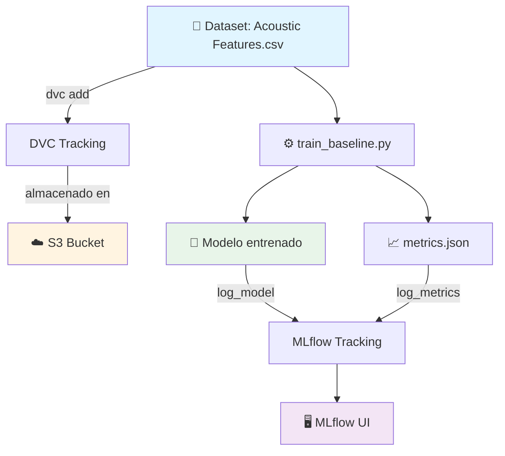

# 🎵 MLOps Equipo 24 – Music Emotion Recognition

<div align="center">

**Proyecto de reconocimiento de emociones musicales utilizando MLOps**

[](https://www.python.org/downloads/)
[](https://mlflow.org/)
[](https://dvc.org/)
[](https://aws.amazon.com/s3/)

</div>

---

## 📋 Tabla de Contenidos

- [Sobre el Proyecto](#-sobre-el-proyecto)
- [Información Académica](#-información-académica)
- [Requisitos Previos](#-requisitos-previos)
- [Instalación](#-instalación)
- [Uso](#-uso)
  - [Usando el Makefile](#%EF%B8%8F-usando-el-makefile)
  - [Trabajar con Notebooks](#trabajar-con-notebooks)
  - [Tracking de Experimentos](#tracking-de-experimentos)
  - [Pipeline DVC](#pipeline-dvc)
- [Arquitectura del Pipeline](#-arquitectura-del-pipeline)
- [Contribución](#-contribución)
- [Equipo](#-equipo)

---

## 🎯 Sobre el Proyecto

Este repositorio contiene la implementación completa de un sistema MLOps para reconocimiento de emociones en música. El proyecto integra:

- 📊 **Versionado de datos** con DVC
- 🔄 **Pipelines reproducibles** automatizados
- 📈 **Tracking de experimentos** con MLflow
- ☁️ **Almacenamiento en la nube** (AWS S3)
- 🤖 **Modelos de Machine Learning** versionados

---

## 📘 Información Académica

**Instituto Tecnológico y de Estudios Superiores de Monterrey**  
*Maestría en Inteligencia Artificial Aplicada (MNA)*

- **Curso:** Operaciones de Aprendizaje Automático
- **Periodo:** Septiembre – Diciembre 2025
- **Equipo:** N° 24

### 👨‍🏫 Profesores

| Rol | Nombre |
|-----|--------|
| Titular | Dr. Gerardo Rodríguez Hernández |
| Titular | Mtro. Ricardo Valdez Hernández |
| Asistente | Mtra. María Mylen Treviño Elizondo |
| Tutor | José Ángel Martínez Navarro |

---

## 🛠 Requisitos Previos

Antes de comenzar, asegúrate de tener instalado:

- Python 3.12
- Git
- Make (incluido en macOS/Linux; en Windows usar Git Bash)
- Credenciales de AWS configuradas

---

## 🚀 Instalación

### 1. Clonar el repositorio

```bash
git clone https://github.com/jrebull/MLOps_Team24.git
cd MLOps_Team24
```

### 2. Configurar entorno virtual

```bash
python -m venv .venv
source .venv/bin/activate  # En Windows: .venv\Scripts\activate
pip install -r requirements.txt
```

### 3. Configurar AWS

Crea o edita el archivo `~/.aws/credentials`:

```ini
[default]
aws_access_key_id = TU_ACCESS_KEY_ID
aws_secret_access_key = TU_SECRET_ACCESS_KEY
region = us-east-1
```

### 4. Descargar datos y modelos

```bash
dvc pull
```

---

## 💻 Uso

### 🛠️ Usando el Makefile

Este repo incluye un `Makefile` con comandos cortos para las tareas comunes.

#### Requisitos
- Python 3.12
- `make` (viene en macOS/Linux; en Windows usar Git Bash)

#### Comandos disponibles

```bash
# 1) Configurar entorno y dependencias
make setup

# 2) Abrir Jupyter Lab
make jupyter

# 3) Levantar MLflow en http://127.0.0.1:5001
make mlflow

# 4) Reproducir pipeline (solo si hubo cambios)
make reproduce

# 5) Forzar etapa de entrenamiento (nuevo run en MLflow)
make train

# 6) Ver métricas actuales y diferencias
make metrics
make diff

# 7) Sincronizar artefactos con el remoto DVC (S3)
make pull
make push

# 8) Limpiar el entorno local
make clean
```

### Trabajar con Notebooks

**Jupyter Lab:**
```bash
jupyter-lab
# o usando make:
make jupyter
```

**VSCode:**
```bash
code .
```

### Tracking de Experimentos

Inicia el servidor MLflow:

```bash
mlflow ui --port 5001
# o usando make:
make mlflow
```

Accede a la interfaz en: **http://127.0.0.1:5001**

### Pipeline DVC

**Ejecutar el pipeline completo:**
```bash
dvc repro
# o usando make:
make reproduce
```

**Ver métricas actuales:**
```bash
dvc metrics show
# o usando make:
make metrics
```

**Comparar métricas entre commits:**
```bash
dvc metrics diff
# o usando make:
make diff
```

---

## 🏗 Arquitectura del Pipeline



**Flujo de trabajo:**

1. Los datos se versionan con DVC y se almacenan en S3
2. El script `train_baseline.py` entrena modelos y genera métricas
3. Experimentos y artefactos se registran en MLflow
4. Todo es reproducible y trazable

---

## 🤝 Contribución

### Flujo de trabajo

1. **Crear una nueva rama:**
   ```bash
   git checkout -b feat/nombre-descriptivo
   ```

2. **Realizar cambios y versionar con DVC (si aplica):**
   ```bash
   dvc add <ruta-al-archivo>
   git add <ruta-al-archivo>.dvc .gitignore
   git commit -m "Descripción clara del cambio"
   ```

3. **Subir cambios:**
   ```bash
   git push origin feat/nombre-descriptivo
   dvc push  # o: make push
   ```

4. **Crear Pull Request** a la rama `main`

### Buenas prácticas

- ✅ Ejecuta `make reproduce` antes de hacer commit
- ✅ Documenta tus experimentos en MLflow
- ✅ Escribe mensajes de commit descriptivos
- ✅ Mantén el código limpio y comentado
- ✅ Usa `make` para comandos comunes

---

## 👥 Equipo

<table>
  <tr>
    <td align="center">
      <strong>Sandra Luz Cervantes Espinoza</strong><br>
      <sub>A01796937</sub>
    </td>
    <td align="center">
      <strong>Héctor Jesús López Meza</strong><br>
      <sub>A01226881</sub>
    </td>
    <td align="center">
      <strong>Mauricio Torres Baena</strong><br>
      <sub>A01796697</sub>
    </td>
  </tr>
  <tr>
    <td align="center">
      <strong>David Cruz Beltrán</strong><br>
      <sub>A01360416</sub>
    </td>
    <td align="center">
      <strong>Javier Augusto Rebull Saucedo</strong><br>
      <sub>A01795838</sub>
    </td>
    <td></td>
  </tr>
</table>

---

<div align="center">

**⭐ Si este proyecto te resulta útil, considera darle una estrella**

Desarrollado con ❤️ por el Equipo 24

</div>