# 🎵 Acoustic ML - Music Emotion Recognition

<div align="center">

**MLOps Team 24 - Proyecto de reconocimiento de emociones musicales**

[](https://www.python.org/downloads/)
[](https://mlflow.org/)
[](https://dvc.org/)
[](https://aws.amazon.com/s3/)

<!-- Badges -->
[](#verificación-rápida-antes-de-trabajar)
[](#reproducibilidad-de-entornos)
[](#buenas-prácticas-con-notebooks)

</div>

---

## 📋 Tabla de Contenidos

- [Sobre el Proyecto](#-sobre-el-proyecto)
- [Información Académica](#-información-académica)
- [Estructura del Proyecto](#-estructura-del-proyecto)
- [Requisitos Previos](#-requisitos-previos)
- [Instalación](#-instalación)
- [Gestión de Datos (DVC + S3)](#-gestión-de-datos-dvc--s3)
- [Uso](#-uso)
  - [Usando el Makefile](#%EF%B8%8F-usando-el-makefile)
  - [Usando el Módulo acoustic_ml](#-usando-el-módulo-acoustic_ml)
  - [Trabajar con Notebooks](#trabajar-con-notebooks)
  - [Tracking de Experimentos](#tracking-de-experimentos)
  - [Pipeline DVC](#pipeline-dvc)
- [Verificación Rápida antes de Trabajar](#-verificación-rápida-antes-de-trabajar)
- [Reproducibilidad de Entornos](#-reproducibilidad-de-entornos)
- [Buenas Prácticas con Notebooks](#-buenas-prácticas-con-notebooks)
- [Limpieza Local](#-limpieza-local)
- [Arquitectura del Pipeline](#-arquitectura-del-pipeline)
- [Contribución](#-contribución)
- [Equipo](#-equipo)

---

## 🎯 Sobre el Proyecto

Este repositorio contiene la implementación completa de un sistema MLOps para reconocimiento de emociones en música, siguiendo las mejores prácticas de la industria con la estructura **Cookiecutter Data Science**. El proyecto integra:

- 📊 **Versionado de datos** con DVC
- 🔄 **Pipelines reproducibles** automatizados
- 📈 **Tracking de experimentos** con MLflow
- ☁️ **Almacenamiento en la nube** (AWS S3)
- 🤖 **Modelos de Machine Learning** versionados
- 🗂️ **Estructura modular** siguiendo estándares de la industria

---

## 📘 Información Académica

**Instituto Tecnológico y de Estudios Superiores de Monterrey**  
*Maestría en Inteligencia Artificial Aplicada (MNA)*

- **Curso:** Operaciones de Aprendizaje Automático
- **Periodo:** Septiembre – Diciembre 2025
- **Equipo:** N° 24

### 👨‍🏫 Profesores

| Rol | Nombre |
|-----|--------|
| Titular | Dr. Gerardo Rodríguez Hernández |
| Titular | Mtro. Ricardo Valdez Hernández |
| Asistente | Mtra. María Mylen Treviño Elizondo |
| Tutor | José Ángel Martínez Navarro |

---

## 🗂️ Estructura del Proyecto

Organizado siguiendo **Cookiecutter Data Science** para máxima reproducibilidad y claridad:

```
├── LICENSE                 <- Licencia del proyecto
├── Makefile               <- Comandos útiles (make data, make train, etc.)
├── README.md              <- Este archivo
├── pyproject.toml         <- Configuración del proyecto y dependencias
│
├── data
│   ├── external           <- Datos de fuentes externas
│   ├── interim            <- Datos intermedios transformados
│   ├── processed          <- Datasets finales para modelado
│   └── raw                <- Datos originales inmutables (versionados con DVC)
│       ├── turkis_music_emotion_original.csv      (125 KB)
│       ├── turkish_music_emotion_modified.csv     (130 KB)
│       └── .gitignore                             (Git ignora los CSV)
│
├── models                 <- Modelos entrenados y serializados
│   └── baseline_model.pkl
│
├── notebooks              <- Jupyter notebooks para exploración
│   ├── Fase1_equipo24.ipynb
│   └── NoteBook Testing.ipynb
│   
│   Convención de nombres: número-iniciales-descripción
│   Ej: 1.0-hw-exploratory-analysis.ipynb
│
├── reports                <- Análisis generados (HTML, PDF, etc.)
│   └── figures            <- Gráficas y figuras para reportes
│
├── references             <- Diccionarios de datos, manuales, etc.
│
├── requirements.txt       <- Dependencias del proyecto (pip freeze)
├── requirements-optional.txt
│
├── scripts                <- Scripts auxiliares
│   └── train_baseline.py
│
├── acoustic_ml            <- Código fuente del proyecto (módulo Python)
│   ├── __init__.py        <- Hace de acoustic_ml un módulo Python
│   ├── config.py          <- Configuración y variables globales
│   ├── dataset.py         <- Scripts para cargar/generar datos
│   ├── features.py        <- Feature engineering
│   ├── plots.py           <- Visualizaciones
│   └── modeling           
│       ├── __init__.py
│       ├── train.py       <- Entrenamiento de modelos
│       └── predict.py     <- Inferencia con modelos
│
├── metrics                <- Métricas del pipeline DVC
│   └── metrics.json
│
├── mlruns                 <- Experimentos de MLflow
├── mlartifacts            <- Artifacts de MLflow
├── dvcstore               <- Almacenamiento local de DVC
│
├── .dvc                   <- Configuración de DVC
├── dvc.yaml               <- Definición del pipeline DVC
├── dvc.lock               <- Lock file del pipeline
├── data.dvc               <- Metadatos de tracking (versionado en Git)
│
├── .git                   <- Control de versiones Git
└── .venv                  <- Entorno virtual de Python
```

---

## 🛠 Requisitos Previos

Antes de comenzar, asegúrate de tener instalado:

- **Python 3.12**
- **Git**
- **Make** (incluido en macOS/Linux; en Windows usar Git Bash)
- **Credenciales de AWS** configuradas

---

## 🚀 Instalación

### 1. Clonar el repositorio

```bash
git clone https://github.com/jrebull/MLOps_Team24.git
cd MLOps_Team24
```

### 2. Configurar entorno virtual

```bash
python -m venv .venv
source .venv/bin/activate  # En Windows: .venv\Scripts\activate
pip install -r requirements.txt
```

### 3. Instalar el módulo acoustic_ml en modo desarrollo

```bash
pip install -e .
```

Esto permite importar el módulo desde cualquier lugar:
```python
from acoustic_ml.dataset import load_raw_data
from acoustic_ml.modeling.train import train_model
```

### 4. Configurar AWS (CRÍTICO)

Crea o edita el archivo `~/.aws/credentials`:

```ini
[default]
aws_access_key_id = TU_ACCESS_KEY_ID
aws_secret_access_key = TU_SECRET_ACCESS_KEY
region = us-east-1
```

**Verificar configuración:**
```bash
aws s3 ls s3://mlops24-haowei-bucket/
```

### 5. Descargar datos y modelos

```bash
dvc pull
# o usando make:
make pull
```

### 6. Verificar instalación

```bash
# Verificar módulo
python -c "import acoustic_ml; print(acoustic_ml.__version__)"

# Verificar datos
ls -lh data/raw/

# Verificar DVC
dvc status
```

---

## 📦 Gestión de Datos (DVC + S3)

### 🎯 ¿Dónde están los datos?

Los datasets **NO** están en Git (buena práctica de MLOps). Están versionados con **DVC** y almacenados en **AWS S3**.

**Estructura de almacenamiento:**

```
📁 Local (tu máquina):
MLOps_Team24/
├── data/
│   └── raw/
│       ├── turkis_music_emotion_original.csv   (125 KB)
│       ├── turkish_music_emotion_modified.csv  (130 KB)
│       └── .gitignore  ← Git ignora los CSV
└── data.dvc  ← Metadatos de tracking

☁️ AWS S3 (mlops24-haowei-bucket):
s3://mlops24-haowei-bucket/
└── files/md5/
    ├── ae/5f16bc9e...  ← turkish_music_emotion_modified.csv (130 KB)
    ├── fe/09496b4b...  ← turkis_music_emotion_original.csv (125 KB)
    └── aa/a8c3e8fe...  ← Metadatos de DVC (642 Bytes)

🙂 GitHub:
MLOps_Team24/
└── data.dvc  ← Solo metadatos (~100 bytes, NO los CSV)
```

### 📥 Descargar los datos (Primera vez)

Si acabas de clonar el repositorio:

```bash
# 1. Configura AWS (solo la primera vez)
aws configure
# Ingresa: Access Key, Secret Key, Region (us-east-1)

# 2. Verifica conexión a S3
aws s3 ls s3://mlops24-haowei-bucket/

# 3. Descarga los datos desde S3
dvc pull
# o usando make:
make pull

# 4. Verifica que llegaron
ls -lh data/raw/
# Deberías ver:
# turkis_music_emotion_original.csv   (125 KB)
# turkish_music_emotion_modified.csv  (130 KB)
```

### 📤 Agregar nuevos datos

Si tienes un nuevo dataset:

```bash
# 1. Coloca tu archivo en data/raw/
cp ~/Downloads/nuevo_dataset.csv data/raw/

# 2. Actualiza el tracking de DVC
dvc add data

# 3. Sube a S3
dvc push
# o: make push

# 4. Commitea los metadatos a Git (NO los CSV)
git add data.dvc data/.gitignore
git commit -m "feat: add nuevo_dataset.csv"
git push
```

### 🔄 Actualizar un dataset existente

Si modificaste un archivo de datos:

```bash
# 1. Edita tu archivo
vim data/raw/turkish_music_emotion_modified.csv

# 2. Actualiza DVC (detecta el cambio automáticamente)
dvc add data

# 3. Sube la nueva versión a S3
dvc push

# 4. Commitea el cambio de metadatos
git add data.dvc
git commit -m "feat: update turkish dataset with new features"
git push
```

### ⏮️ Volver a una versión anterior

```bash
# 1. Encuentra el commit donde estaba la versión que quieres
git log --oneline data.dvc

# Ejemplo de output:
# a1b2c3d feat: update turkish dataset with new features
# e4f5g6h feat: add nuevo_dataset.csv
# i7j8k9l Initial data setup

# 2. Vuelve a ese commit
git checkout i7j8k9l data.dvc

# 3. Descarga esa versión desde S3
dvc checkout

# 4. Si quieres quedarte con esta versión:
git add data.dvc
git commit -m "revert: rollback to previous dataset version"
git push
```

### 🔍 Verificar estado de los datos

```bash
# Ver si tus datos están sincronizados con S3
dvc status
# Output esperado: "Data and pipelines are up to date."

# Ver configuración de remotes
dvc remote list
# Output: 
# localstore  /Users/haowei/Documents/MLOps/.../dvcstore
# s3store     s3://mlops24-haowei-bucket (default)

# Ver qué archivos trackea DVC
cat data.dvc
# Output:
# outs:
# - md5: e2614136020a8d97866fd4bd562ca328.dir
#   size: 172458
#   nfiles: 5
#   path: data
```

### 🌐 Ver datos en AWS Console

Accede visualmente a tus datos:

1. Ve a: **https://s3.console.aws.amazon.com/s3/buckets/mlops24-haowei-bucket**
2. Navega a: `files/` → `md5/`
3. Verás carpetas con tus datasets (almacenados por hash MD5)

**Ejemplos de lo que verás:**
- `ae/5f16bc9e319aa4323f8d08e3306e70` → turkish_music_emotion_modified.csv (130 KB)
- `fe/09496b4b8025ad634778901b8db3cb` → turkis_music_emotion_original.csv (125 KB)

### 🚨 Problemas comunes

**Problema:** `dvc pull` falla con error de AWS
```bash
# Solución: Verifica tus credenciales
aws s3 ls s3://mlops24-haowei-bucket/
# Si falla, reconfigura:
aws configure
```

**Problema:** "Cache is missing" o archivos no se descargan
```bash
# Solución: Fuerza la descarga
dvc pull -f
```

**Problema:** Cambios en datos pero DVC no los detecta
```bash
# Solución: Re-trackea forzando
dvc add data --force
dvc push
```

**Problema:** "Data and pipelines are up to date" pero no tengo archivos localmente
```bash
# Solución: Fuerza checkout
dvc checkout
# Si persiste:
rm -rf .dvc/cache
dvc pull
```

### 📋 Comandos de referencia rápida

```bash
# Descargar datos desde S3
dvc pull          # Usando DVC
make pull         # Usando Makefile

# Subir datos a S3
dvc push          # Usando DVC
make push         # Usando Makefile

# Ver estado de sincronización
dvc status        # Estado actual
make status       # Usando Makefile

# Verificar configuración
dvc remote list   # Lista remotes configurados
dvc config --list # Configuración completa de DVC

# Ver qué está trackeado
cat data.dvc      # Metadatos de tracking

# Ver contenido en S3 (via CLI)
aws s3 ls s3://mlops24-haowei-bucket/files/md5/ --recursive --human-readable
```

### 🎓 ¿Por qué esta arquitectura?

**Ventajas del enfoque DVC + S3:**

✅ **Separación clara:** Código en Git, Datos en S3  
✅ **Versionado:** Cada cambio en datos se versiona  
✅ **Colaboración:** Todo el equipo accede a los mismos datos  
✅ **Reproducibilidad:** Cualquiera puede `dvc pull` y obtener los datos exactos  
✅ **Eficiencia:** Git no se satura con archivos grandes  
✅ **Trazabilidad:** Sabes exactamente qué versión de datos usó cada experimento

---

## 💻 Uso

### 🛠️ Usando el Makefile

Este repo incluye un `Makefile` con comandos cortos para las tareas comunes.

#### Comandos disponibles

```bash
# 1) Configurar entorno y dependencias
make setup

# 2) Abrir Jupyter Lab
make jupyter

# 3) Levantar MLflow en http://127.0.0.1:5001
make mlflow

# 4) Reproducir pipeline (solo si hubo cambios)
make reproduce

# 5) Forzar etapa de entrenamiento (nuevo run en MLflow)
make train

# 6) Ver métricas actuales y diferencias
make metrics
make diff

# 7) Sincronizar artefactos con el remoto DVC (S3)
make pull
make push

# 8) Limpiar el entorno local
make clean
make clean-caches

# 9) Exportar dependencias actuales
make freeze

# 10) Verificar sincronización antes de trabajar
make verify-sync

# 11) Muestra si hay datos desactualizados
make status
```

### 🐍 Usando el Módulo acoustic_ml

El proyecto está organizado como un módulo Python instalable. Ejemplos de uso:

#### Cargar datos

```python
from acoustic_ml.dataset import load_raw_data, save_processed_data

# Cargar datos crudos
df = load_raw_data("turkish_music_emotion_original.csv")

# Procesar y guardar
df_processed = process_data(df)
save_processed_data(df_processed, "features_v1.csv")
```

#### Feature Engineering

```python
from acoustic_ml.features import create_features, select_features

# Crear features adicionales
df_with_features = create_features(df)

# Seleccionar features específicas
features = ['tempo', 'energy', 'valence']
df_selected = select_features(df_with_features, features)
```

#### Entrenar modelos

```python
from acoustic_ml.modeling.train import train_model

# Entrenar modelo (registra en MLflow automáticamente)
model = train_model(X_train, y_train)
```

#### Hacer predicciones

```python
from acoustic_ml.modeling.predict import load_model, predict

# Cargar modelo entrenado
model = load_model("baseline_model.pkl")

# Predecir
predictions = predict(model, X_test)
```

#### Crear visualizaciones

```python
from acoustic_ml.plots import plot_feature_importance, save_figure

# Crear gráfica
fig = plot_feature_importance(feature_importance_dict)

# Guardar en reports/figures/
save_figure(fig, "feature_importance.png")
```

### Trabajar con Notebooks

**Jupyter Lab:**
```bash
jupyter-lab
# o usando make:
make jupyter
```

**VSCode:**
```bash
code .
```

**Importar módulo en notebooks:**
```python
# En tus notebooks ahora puedes hacer:
from acoustic_ml.dataset import load_raw_data
from acoustic_ml.config import RAW_DATA_DIR, MODELS_DIR

# Cargar datos
df = load_raw_data()
print(f"Datos cargados desde: {RAW_DATA_DIR}")
```

### Tracking de Experimentos

Inicia el servidor MLflow:

```bash
mlflow ui --port 5001
# o usando make:
make mlflow
```

Accede a la interfaz en: **http://127.0.0.1:5001**

### Pipeline DVC

**Ejecutar el pipeline completo:**
```bash
dvc repro
# o usando make:
make reproduce
```

**Ver métricas actuales:**
```bash
dvc metrics show
# o usando make:
make metrics
```

**Comparar métricas entre commits:**
```bash
dvc metrics diff
# o usando make:
make diff
```

---

## ✅ Verificación Rápida antes de Trabajar

> Usa el `Makefile` para confirmar que tu repo está **limpio**, **sincronizado** y que el notebook principal **no tiene diffs**.

```bash
make verify-sync
# o, si trabajas con otro notebook:
make verify-sync NOTEBOOK=notebooks/tu_notebook.ipynb
```

**Qué valida:**
- ✔ Árbol de trabajo limpio (sin cambios sin commit)
- ✔ HEAD == origin/<rama> (sin ahead/behind)
- ✔ El notebook indicado no tiene diferencias locales

Si algo falla, el comando te dirá exactamente qué corregir (pull/push/diff).

---

## 🔄 Reproducibilidad de Entornos

Exporta dependencias después de instalar paquetes nuevos:

```bash
make freeze
# luego:
git add requirements.txt
git commit -m "chore: update dependencies"
git push
```

Reconstrucción rápida en cualquier máquina:

```bash
python -m venv .venv
source .venv/bin/activate   # Windows: .venv\Scripts\activate
pip install -r requirements.txt
pip install -e .  # Instalar módulo acoustic_ml
```

---

## 🐳 Docker compose

```

├── docker-compose.yml
├── config.env
├── mlartifacts/           # Almacena los artefactos de MLflow 
├── ml_pipeline.py
├── requirements.txt
├── acoustic_ml/           # Módulo del proyecto
├── .venv/                 # Entorno virtual local

```
--- 
⚙️ Archivos requeridos
✅ config.env

⚙️ Comandos de uso

🔧 Levantar servicios

```bash
docker-compose --env-file config.env up -d --build
```

MinIO (Consola): http://localhost:9001

🛑 Detener los servicios
```bash
docker-compose down
```
🔁 Reiniciar 
```bash
docker-compose --env-file config.env up -d --build
```

## 📓 Buenas Prácticas con Notebooks

Instala hooks para limpiar outputs y tener diffs legibles:

```bash
make nb-hooks
```

**Beneficios:**
- `nbstripout` limpia salidas/celdas ejecutadas al commitear
- `nbdime` muestra diffs de `.ipynb` de forma amigable

**Convención de nombres para notebooks:**
```
<número>.<versión>-<iniciales>-<descripción-corta>.ipynb

Ejemplos:
- 1.0-jrs-initial-data-exploration.ipynb
- 2.0-hw-feature-engineering.ipynb
- 3.1-sc-model-evaluation.ipynb
```

**Tip:** Antes de commitear, puedes correr `make verify-sync` para asegurarte de que todo está en orden.

---

## 🧹 Limpieza Local

Si necesitas borrar cachés locales (sin afectar Git):

```bash
make clean-caches
```

Esto elimina `__pycache__`, `.ipynb_checkpoints` y archivos temporales solo en tu máquina.

Limpieza completa (incluye artefactos de MLflow/DVC):
```bash
make clean
```

---

## 🏗 Arquitectura del Pipeline

```mermaid
flowchart TD
    A[📂 data/raw/*.csv] -->|dvc add| B[DVC Tracking]
    B -->|almacenado en| C[☁️ S3: mlops24-haowei-bucket]
    A --> D[⚙️ acoustic_ml/modeling/train.py]
    D --> E[🤖 models/baseline_model.pkl]
    D --> F[📈 metrics/metrics.json]
    E -->|log_model| G[MLflow Tracking]
    F -->|log_metrics| G
    G --> H[🖥 MLflow UI :5001]
    
    style A fill:#e1f5ff
    style C fill:#fff4e1
    style E fill:#e8f5e9
    style H fill:#f3e5f5
```



**Flujo de trabajo:**

1. Los datos crudos viven en `data/raw/` y se versionan con DVC
2. Se almacenan en S3 (`mlops24-haowei-bucket`) para colaboración
3. El módulo `acoustic_ml` procesa datos y entrena modelos
4. Modelos entrenados se guardan en `models/`
5. Experimentos y artefactos se registran en MLflow
6. Métricas se trackean con DVC en `metrics/metrics.json`
7. Todo es reproducible y trazable

---

## 🤝 Contribución

### Flujo de trabajo

1. **Verificar sincronización:**
   ```bash
   make verify-sync
   ```

2. **Crear una nueva rama:**
   ```bash
   git checkout -b feat/nombre-descriptivo
   ```

3. **Realizar cambios:**
   
   **Si modificas código Python:**
   ```bash
   # Edita archivos en acoustic_ml/
   vim acoustic_ml/features.py
   
   # Los cambios están disponibles inmediatamente (instalación en modo -e)
   ```

   **Si modificas datos:**
   ```bash
   dvc add data
   git add data.dvc data/.gitignore
   dvc push
   ```

   **Si instalaste paquetes:**
   ```bash
   make freeze
   git add requirements.txt
   ```

4. **Commitear cambios:**
   ```bash
   git add .
   git commit -m "feat: descripción clara del cambio"
   ```

5. **Subir cambios:**
   ```bash
   git push origin feat/nombre-descriptivo
   dvc push  # o: make push
   ```

6. **Crear Pull Request** a la rama `main`

### Buenas prácticas

- ✅ Ejecuta `make verify-sync` antes de comenzar a trabajar
- ✅ Ejecuta `dvc status` para verificar estado de datos
- ✅ Ejecuta `make reproduce` antes de hacer commit
- ✅ Documenta tus experimentos en MLflow
- ✅ Escribe mensajes de commit descriptivos ([Conventional Commits](https://www.conventionalcommits.org/))
- ✅ Mantén el código limpio y con docstrings
- ✅ Usa `make nb-hooks` para configurar hooks de notebooks
- ✅ Escribe código en el módulo `acoustic_ml/`, no en notebooks
- ✅ Los notebooks son para exploración, el código productivo va en el módulo
- ✅ Siempre haz `dvc push` después de modificar datos

---

## 👥 **Equipo de Desarrollo**

<div align="center">

<table style="width:100%; border:none;">
  <tr>
    <td align="center" style="border:none; padding:20px 10px;">
      
      <h3>David Cruz Beltrán</h3>
      
      <p><strong>🔧 Software Engineer</strong><br/>
      <em>Data Pipeline & Versioning</em></p>
    </td>
    <td align="center" style="border:none; padding:20px 10px;">
      
      <h3>Javier Augusto Rebull Saucedo</h3>
      
      <p><strong>⚙️ SRE / Data Engineer</strong><br/>
      <em>DevOps & Infrastructure</em></p>
    </td>
    <td align="center" style="border:none; padding:20px 10px;">
      
      <h3>Sandra Luz Cervantes Espinoza</h3>
      
      <p><strong>🤖 ML Engineer / Data Scientist</strong><br/>
      <em>Model Development & Analysis</em></p>
    </td>
  </tr>
</table>

</div>

---

<div align="center">

**⭐ Si este proyecto te resulta útil, considera darle una estrella**

Desarrollado con ❤️ por el Equipo 24 | Estructura basada en [Cookiecutter Data Science](https://drivendata.github.io/cookiecutter-data-science/)

</div>
